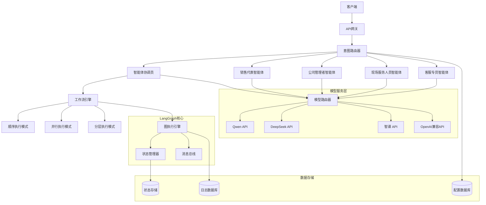

# 设计文档

## 概述

多智能体LangGraph服务是一个基于FastAPI和LangGraph构建的企业级后台服务系统。系统采用微服务架构，通过RESTful API提供多智能体协作能力，支持意图识别、智能路由、任务分解与执行等核心功能。

### 技术栈

- **Python版本**：Python 3.12
- **包管理器**：uv (用于依赖管理和程序运行)
- **开发环境**：Windows + CMD终端
- **Web框架**：FastAPI
- **AI框架**：LangGraph
- **运行方式**：所有Python相关操作通过uv执行

### 核心设计原则

- **模块化设计**：各组件职责清晰，便于维护和扩展
- **异步处理**：支持高并发请求处理
- **可配置性**：支持灵活的智能体配置和协作模式
- **可观测性**：完整的日志记录和监控能力
- **容错性**：支持故障恢复和降级处理

## 架构

### 系统架构图



### 分层架构

1. **API层**：FastAPI应用，处理HTTP请求和响应
2. **业务逻辑层**：意图识别、路由决策、任务协调
3. **智能体层**：各专业角色智能体实现
4. **工作流引擎层**：LangGraph图执行和状态管理
5. **模型服务层**：多模型支持和API调用
6. **数据存储层**：配置、日志和状态持久化

## 组件和接口

### 核心组件

#### 1. API网关 (FastAPI Application)

```python
# 主要接口定义
class MultiAgentAPI:
    POST /api/v1/chat/completions          # 智能体对话接口
    POST /api/v1/agents/route              # 意图路由接口
    POST /api/v1/workflows/execute         # 工作流执行接口
    GET  /api/v1/agents/status             # 智能体状态查询
    GET  /api/v1/workflows/{id}/status     # 工作流状态查询
    POST /api/v1/config/agents             # 智能体配置接口
    GET  /api/v1/health                    # 健康检查接口
```

#### 2. 意图路由器 (Intent Router)

```python
class IntentRouter:
    def analyze_intent(self, user_input: str) -> IntentResult
    def route_to_agent(self, intent: IntentResult) -> AgentType
    def should_collaborate(self, intent: IntentResult) -> bool
```

#### 3. 智能体协调员 (Agent Coordinator)

```python
class AgentCoordinator:
    def coordinate_agents(self, task: Task) -> WorkflowPlan
    def execute_workflow(self, plan: WorkflowPlan) -> ExecutionResult
    def handle_conflicts(self, conflicts: List[Conflict]) -> Resolution
```

#### 4. 专业智能体基类

```python
class BaseAgent:
    def __init__(self, name: str, role: str, capabilities: List[str])
    def process_request(self, request: AgentRequest) -> AgentResponse
    def collaborate(self, other_agents: List[BaseAgent]) -> CollaborationResult
    def get_status(self) -> AgentStatus
```

#### 5. 工作流引擎 (Workflow Engine)

```python
class WorkflowEngine:
    def create_graph(self, workflow_type: WorkflowType) -> LangGraph
    def execute_sequential(self, tasks: List[Task]) -> ExecutionResult
    def execute_parallel(self, tasks: List[Task]) -> ExecutionResult
    def execute_hierarchical(self, tasks: List[Task]) -> ExecutionResult
```

#### 6. 模型服务路由器 (Model Router)

```python
class ModelRouter:
    def route_request(self, request: ModelRequest) -> ModelProvider
    def call_model_api(self, provider: ModelProvider, request: ModelRequest) -> ModelResponse
    def handle_failover(self, failed_provider: ModelProvider) -> ModelProvider
```

### 智能体角色定义

#### 1. 智能体总协调员 (Agent Coordinator)
- **职责**：统筹管理其他智能体，制定协作策略
- **能力**：任务分解、资源调度、冲突解决
- **协作模式**：主要用于Hierarchical模式

#### 2. 销售代表智能体 (Sales Agent)
- **职责**：处理销售相关询问和业务
- **能力**：产品介绍、报价、客户关系管理
- **专业领域**：销售流程、客户需求分析

#### 3. 公司管理者智能体 (Manager Agent)
- **职责**：处理管理决策和战略规划
- **能力**：决策分析、资源配置、政策制定
- **专业领域**：企业管理、战略规划

#### 4. 现场服务人员智能体 (Field Service Agent)
- **职责**：处理现场服务和技术支持
- **能力**：故障诊断、维修指导、服务调度
- **专业领域**：技术服务、现场操作

#### 5. 客服专员智能体 (Customer Support Agent)
- **职责**：处理客户咨询和问题解决
- **能力**：问题诊断、解决方案提供、客户安抚
- **专业领域**：客户服务、问题处理

## 数据模型

### 核心数据结构

#### 1. 用户请求模型

```python
class UserRequest(BaseModel):
    request_id: str
    user_id: Optional[str]
    content: str
    context: Dict[str, Any]
    timestamp: datetime
    priority: Priority = Priority.NORMAL
```

#### 2. 意图识别结果

```python
class IntentResult(BaseModel):
    intent_type: IntentType
    confidence: float
    entities: List[Entity]
    suggested_agents: List[AgentType]
    requires_collaboration: bool
```

#### 3. 智能体响应模型

```python
class AgentResponse(BaseModel):
    agent_id: str
    agent_type: AgentType
    response_content: str
    confidence: float
    next_actions: List[Action]
    collaboration_needed: bool
```

#### 4. 工作流状态模型

```python
class WorkflowState(BaseModel):
    workflow_id: str
    status: WorkflowStatus
    current_step: int
    total_steps: int
    participating_agents: List[str]
    execution_history: List[ExecutionStep]
    created_at: datetime
    updated_at: datetime
```

#### 5. 智能体配置模型

```python
class AgentConfig(BaseModel):
    agent_id: str
    agent_type: AgentType
    name: str
    description: str
    capabilities: List[str]
    model_config: ModelConfig
    prompt_template: str
    max_tokens: int
    temperature: float
```

## 错误处理

### 错误分类和处理策略

#### 1. API层错误
- **400 Bad Request**：请求格式错误、参数缺失
- **401 Unauthorized**：认证失败
- **429 Too Many Requests**：请求频率限制
- **500 Internal Server Error**：服务内部错误

#### 2. 业务逻辑错误
- **意图识别失败**：返回默认路由或人工介入
- **智能体不可用**：自动故障转移到备用智能体
- **协作冲突**：启动冲突解决机制

#### 3. 模型服务错误
- **API调用失败**：自动重试机制
- **模型响应超时**：切换到备用模型
- **配额耗尽**：故障转移到其他服务商

#### 4. 系统级错误
- **数据库连接失败**：使用缓存数据继续服务
- **内存不足**：清理缓存，限制并发
- **网络异常**：重试机制和降级服务

### 错误恢复机制

```python
class ErrorHandler:
    def handle_api_error(self, error: APIError) -> ErrorResponse
    def handle_agent_error(self, error: AgentError) -> FallbackStrategy
    def handle_model_error(self, error: ModelError) -> ModelFailover
    def handle_system_error(self, error: SystemError) -> RecoveryAction
```

## 测试策略

### 测试层次

#### 1. 单元测试
- **智能体功能测试**：验证各智能体的核心功能
- **路由逻辑测试**：验证意图识别和路由准确性
- **工作流测试**：验证各协作模式的执行逻辑
- **模型接口测试**：验证模型API调用和响应处理

#### 2. 集成测试
- **端到端流程测试**：完整的用户请求处理流程
- **智能体协作测试**：多智能体协同工作验证
- **故障转移测试**：验证各种故障场景的处理
- **性能测试**：并发请求处理能力验证

#### 3. 系统测试
- **负载测试**：高并发场景下的系统稳定性
- **压力测试**：系统极限处理能力
- **可靠性测试**：长时间运行稳定性
- **安全测试**：API安全性和数据保护

### 测试数据和场景

#### 1. 典型业务场景
- **销售咨询场景**：产品询价、功能介绍
- **客服支持场景**：问题报告、解决方案
- **管理决策场景**：数据分析、策略制定
- **现场服务场景**：故障处理、维修指导

#### 2. 协作模式测试
- **Sequential模式**：按顺序处理复杂业务流程
- **Parallel模式**：同时处理多个独立任务
- **Hierarchical模式**：分层决策和任务分配

#### 3. 异常场景测试
- **网络中断**：模拟网络不稳定情况
- **模型服务异常**：API调用失败和超时
- **高并发压力**：大量同时请求处理
- **数据异常**：错误格式和缺失数据处理

### 测试自动化

```python
class TestSuite:
    def test_intent_recognition(self) -> TestResult
    def test_agent_routing(self) -> TestResult
    def test_workflow_execution(self) -> TestResult
    def test_model_integration(self) -> TestResult
    def test_error_handling(self) -> TestResult
    def test_performance_benchmarks(self) -> TestResult
```

## 开发环境配置

### 项目结构

```
multi-agent-service/
├── pyproject.toml              # uv项目配置文件
├── uv.lock                     # 依赖锁定文件
├── README.md                   # 项目说明文档
├── .env.example                # 环境变量模板
├── src/
│   └── multi_agent_service/
│       ├── __init__.py
│       ├── main.py             # FastAPI应用入口
│       ├── config/             # 配置管理
│       ├── api/                # API路由定义
│       ├── agents/             # 智能体实现
│       ├── workflows/          # 工作流引擎
│       ├── models/             # 数据模型
│       └── utils/              # 工具函数
├── tests/                      # 测试代码
├── docs/                       # 文档
└── scripts/                    # 部署和运维脚本
```

### 依赖管理

使用uv进行包管理，主要依赖包括：

```toml
[project]
name = "multi-agent-service"
version = "0.1.0"
description = "Multi-Agent LangGraph Service"
requires-python = ">=3.12"
dependencies = [
    "fastapi>=0.104.0",
    "uvicorn>=0.24.0",
    "langgraph>=0.0.40",
    "langchain>=0.1.0",
    "pydantic>=2.5.0",
    "httpx>=0.25.0",
    "python-multipart>=0.0.6",
    "python-dotenv>=1.0.0",
]
```

### 运行命令

```cmd
# 安装依赖
uv sync

# 启动开发服务器
uv run uvicorn src.multi_agent_service.main:app --reload --host 0.0.0.0 --port 8000

# 运行测试
uv run pytest tests/

# 代码格式化
uv run black src/ tests/
uv run isort src/ tests/

# 类型检查
uv run mypy src/
```