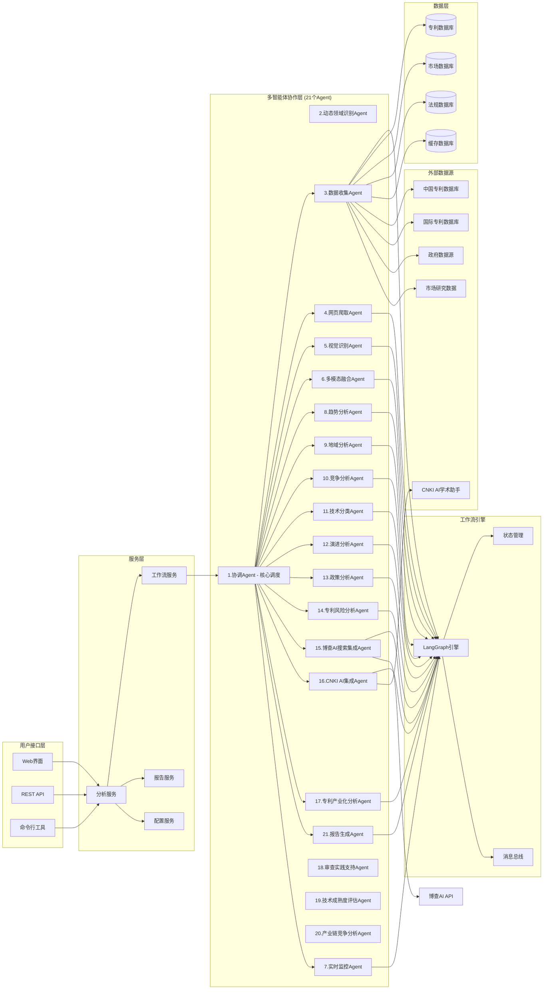
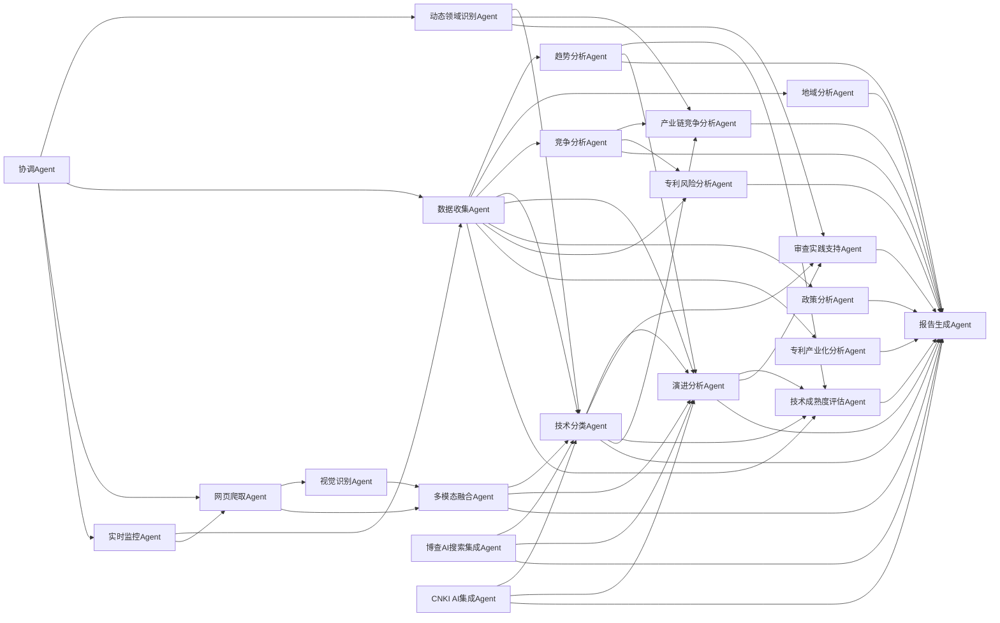
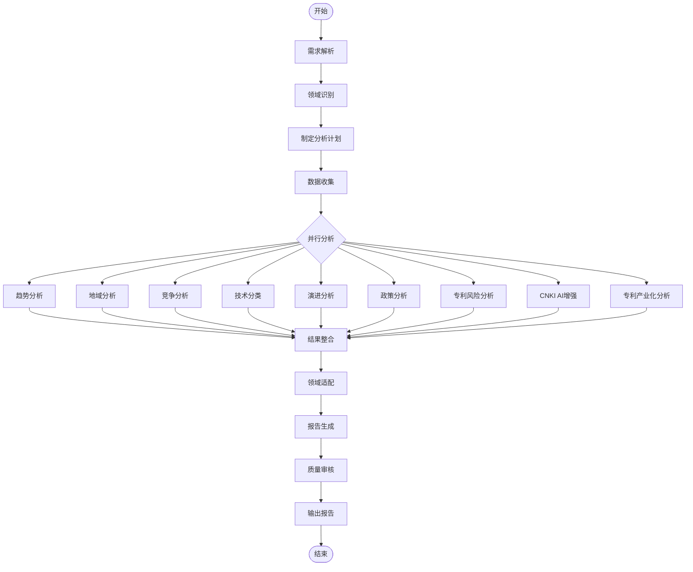
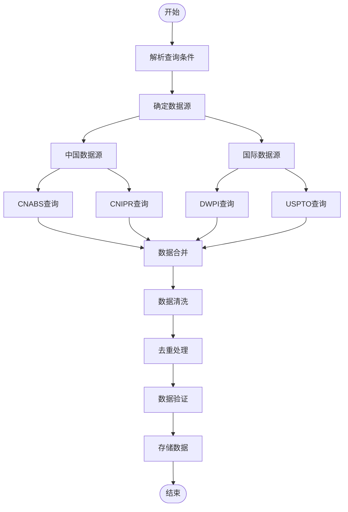
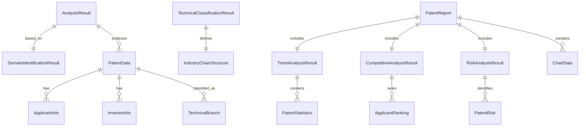

# 专利技术综述分析系统设计文档

## 概述

专利技术综述分析系统是一个基于多智能体协作的专利分析平台，专门为中国市场设计。系统通过21个专业化Agent的有机配合，自动化完成专利技术综述报告的生成。系统采用LangGraph工作流引擎，支持复杂的多Agent协作模式，能够处理从数据收集到报告生成的完整分析流程。

**系统架构特点**：
- **Agent总数**：21个专业化Agent，分为4个层次（协调层、数据层、分析层、输出层）
- **工作流引擎**：基于LangGraph的状态机工作流，支持并行和串行执行
- **数据处理能力**：支持文本、图像、表格等多模态数据融合分析
- **实时性能**：支持实时监控和动态更新，数据刷新频率≤1小时
- **扩展性设计**：模块化架构，支持新Agent热插拔和动态扩容

### 系统核心特色

1. **全面的专利分析覆盖**：涵盖8个核心分析维度（趋势、地域、竞争、技术、演进、政策、风险、产业化），分析覆盖率≥95%
2. **中国特色深度适配**：支持中文专利处理、本土数据源整合、政策环境分析、产业化评估等本土化功能，中文处理准确率≥92%
3. **智能化协作机制**：21个专业Agent通过LangGraph工作流引擎实现智能协作和结果整合，协作效率提升≥40%
4. **动态领域适配**：自动识别技术领域并动态调整分析框架和产业链结构，领域识别准确率≥88%
5. **多模态数据融合**：集成网页爬取、视觉识别、学术搜索等能力，数据来源丰富度提升≥60%
6. **实时监控更新**：支持专利状态、技术发展、市场动态的实时监控，数据时效性≤24小时
7. **专业审查支持**：为专利审查员提供检索策略优化和对比文件发现能力，检索效率提升≥30%

## 架构设计

### 系统架构图



## 模块间钩稽关系分析

### Agent协作依赖关系图



### 数据流和依赖关系

#### 1. 核心数据流路径
- **主数据流**: 协调Agent → 动态领域识别 → 数据收集 → 各专业分析Agent → 报告生成
- **增强数据流**: CNKI AI集成 → 技术分类/演进分析 → 报告生成
- **交叉验证流**: 多个分析Agent → 结果交叉验证 → 质量控制

#### 2. 关键依赖关系
- **技术分类Agent**: 为演进分析、审查支持、成熟度评估、产业链分析提供基础分类
- **趋势分析Agent**: 为成熟度评估和演进分析提供时间序列数据
- **竞争分析Agent**: 为产业链竞争分析和风险分析提供企业信息
- **动态领域识别Agent**: 为所有分析Agent提供领域上下文和分析框架

#### 3. 结果整合机制
- **分层整合**: 基础数据 → 专业分析 → 综合评估 → 报告生成
- **质量控制**: 多Agent交叉验证 → 一致性检查 → 置信度评估
- **动态调整**: 基于分析结果动态调整后续分析策略

### 核心组件

#### 1. 多智能体系统（21个专业化Agent）

**协调层Agent（1个）**：
- **协调Agent (CoordinatorAgent)**: 负责任务分配、流程控制和结果整合，支持21个Agent的统一调度

**数据获取层Agent（6个）**：
- **动态领域识别Agent (DynamicDomainIdentificationAgent)**: 自动识别技术领域并动态适配分析框架
- **数据收集Agent (DataCollectionAgent)**: 专门负责从各种数据源收集专利信息
- **网页爬取Agent (WebCrawlingAgent)**: 智能爬取网页内容，支持多种反爬虫策略
- **视觉识别Agent (VisionRecognitionAgent)**: 识别和分析专利图纸、技术图表等视觉内容
- **多模态融合Agent (MultiModalFusionAgent)**: 融合文本、图像、表格等多模态数据
- **实时监控Agent (RealTimeMonitoringAgent)**: 实时监控专利状态和技术发展动态

**专业分析层Agent（12个）**：
- **趋势分析Agent (TrendAnalysisAgent)**: 分析专利申请趋势和技术发展阶段
- **地域分析Agent (GeographicAnalysisAgent)**: 分析专利的地域分布和市场布局
- **竞争分析Agent (CompetitiveAnalysisAgent)**: 分析申请人和竞争格局
- **技术分类Agent (TechnicalClassificationAgent)**: 进行技术构成和分类分析
- **演进分析Agent (EvolutionAnalysisAgent)**: 分析技术路线和演进过程
- **政策分析Agent (PolicyAnalysisAgent)**: 分析法规环境对技术发展的影响
- **专利风险分析Agent (PatentRiskAnalysisAgent)**: 识别专利侵权风险和提供规避建议
- **博查AI搜索集成Agent (BochaAISearchAgent)**: 集成博查AI的互联网搜索和智能分析能力
- **CNKI AI集成Agent (CNKIAIIntegrationAgent)**: 集成CNKI AI学术研究助手的智能分析能力
- **专利产业化分析Agent (PatentCommercializationAgent)**: 分析专利产业化情况和转化效果
- **审查实践支持Agent (ExaminationSupportAgent)**: 支持专利审查实践，提供检索策略和对比文件发现
- **技术成熟度评估Agent (TechnologyMaturityAgent)**: 评估技术成熟度和发展阶段

**输出整合层Agent（2个）**：
- **产业链竞争分析Agent (IndustryChainCompetitionAgent)**: 分析产业链上中下游竞争格局和价值分布
- **报告生成Agent (ReportGenerationAgent)**: 生成最终的综述报告

#### 2. 工作流引擎
基于LangGraph构建的工作流引擎，支持：
- 顺序执行工作流
- 并行执行工作流
- 分层协作工作流
- 条件分支工作流

#### 3. 数据管理层
- 专利数据存储和索引
- 缓存机制优化性能
- 数据质量控制和清洗
- 多数据源整合

## 组件设计

### Agent设计

#### 协调Agent (CoordinatorAgent)
```python
class CoordinatorAgent(BaseAgent):
    """协调Agent，负责整个分析流程的协调和控制"""
    
    capabilities = [
        "task_orchestration",
        "workflow_management", 
        "result_integration",
        "quality_control",
        "report_structure_planning",
        "domain_adaptive_coordination"
    ]
    
    # 通用报告结构模板
    base_report_structure = {
        "前言": "分析背景和目的",
        "行业重要性分析": "技术在国民经济中的地位",
        "市场竞争状况": "全球和国内市场格局",
        "技术现状分析": "核心技术和发展水平",
        "专利技术分析": "专利申请趋势和技术分布",
        "专利竞争分析": "主要申请人和竞争格局",
        "重要专利风险": "侵权风险和规避策略",
        "优势及防范措施": "本土企业发展建议",
        "结语": "总结和展望"
    }
    
    # 领域特定的报告结构调整
    domain_specific_adjustments = {
        "生物医药": {
            "additional_sections": ["临床试验分析", "监管环境影响"],
            "emphasis": ["药物安全性", "临床有效性", "监管合规"]
        },
        "人工智能": {
            "additional_sections": ["算法创新分析", "数据隐私考量"],
            "emphasis": ["算法原创性", "数据安全", "伦理合规"]
        },
        "新能源": {
            "additional_sections": ["环保效益分析", "政策支持影响"],
            "emphasis": ["环境友好性", "能源效率", "政策导向"]
        }
    }
    
    async def process_request(self, request: UserRequest) -> AgentResponse:
        # 1. 解析分析需求和识别技术领域
        domain_info = await self._identify_domain(request)
        
        # 2. 根据领域特点制定分析计划
        analysis_plan = await self._create_domain_adaptive_plan(domain_info)
        
        # 3. 分配任务给专业Agent
        task_assignments = await self._assign_tasks(analysis_plan)
        
        # 4. 监控执行进度
        execution_results = await self._monitor_execution(task_assignments)
        
        # 5. 整合分析结果
        integrated_results = await self._integrate_results(execution_results, domain_info)
        
        return integrated_results
    
    async def _create_domain_adaptive_plan(self, domain_info: Dict[str, Any]) -> Dict[str, Any]:
        """根据领域特点创建自适应分析计划"""
        base_plan = self._get_base_analysis_plan()
        
        # 根据领域特点调整分析重点
        if domain_info["primary_domain"] in self.domain_specific_adjustments:
            adjustments = self.domain_specific_adjustments[domain_info["primary_domain"]]
            base_plan = self._apply_domain_adjustments(base_plan, adjustments)
        
        return base_plan
```

#### 数据收集Agent (DataCollectionAgent)
```python
class DataCollectionAgent(BaseAgent):
    """数据收集Agent，负责从多个数据源收集专利信息"""
    
    capabilities = [
        "patent_data_retrieval",
        "data_source_integration",
        "data_quality_control",
        "chinese_patent_processing"
    ]
    
    data_sources = {
        "cnabs": "中国专利摘要数据库",
        "cnipr": "中国知识产权网",
        "dwpi": "德温特世界专利索引",
        "uspto": "美国专利商标局",
        "epo": "欧洲专利局"
    }
```

#### 趋势分析Agent (TrendAnalysisAgent)
```python
class TrendAnalysisAgent(BaseAgent):
    """趋势分析Agent，分析专利申请趋势和技术发展阶段"""
    
    capabilities = [
        "trend_analysis",
        "growth_rate_calculation",
        "lifecycle_identification",
        "forecasting"
    ]
    
    analysis_methods = [
        "time_series_analysis",
        "s_curve_fitting",
        "hype_cycle_analysis",
        "patent_landscape_mapping"
    ]
```

#### 技术分类Agent (TechnicalClassificationAgent)
```python
class TechnicalClassificationAgent(BaseAgent):
    """技术分类Agent，进行技术构成和分类分析"""
    
    capabilities = [
        "ipc_classification",
        "cpc_classification", 
        "chinese_classification",
        "semantic_clustering",
        "technology_mapping",
        "dynamic_industry_chain_analysis",
        "domain_specific_classification",
        "technical_branch_analysis",
        "technology_evolution_tracking",
        "technical_maturity_assessment"
    ]
    
    classification_systems = [
        "ipc",  # 国际专利分类
        "cpc",  # 合作专利分类
        "chinese_patent_classification",  # 中国专利分类
        "custom_taxonomy"  # 自定义分类体系
    ]
    
    # 通用产业链分析框架
    industry_chain_framework = {
        "上游": {
            "description": "原材料、核心零部件、基础技术",
            "analysis_focus": ["供应商集中度", "技术壁垒", "成本结构", "关键技术"]
        },
        "中游": {
            "description": "产品制造、系统集成、核心产品",
            "analysis_focus": ["制造工艺", "产品创新", "品牌竞争", "规模效应"]
        },
        "下游": {
            "description": "应用场景、系统集成、服务支持",
            "analysis_focus": ["市场需求", "应用创新", "服务模式", "用户体验"]
        }
    }
    
    # 领域特定产业链模板（可动态扩展）
    domain_templates = {
        "机器人": {
            "上游": {
                "核心零部件": ["减速器", "伺服系统", "控制器"],
                "关键技术": ["精密减速器", "伺服电机", "运动控制器", "传感器技术"],
                "基础材料": ["高强度材料", "精密加工", "电子元器件"],
                "技术特点": "技术壁垒高，长期被美日德等国企业垄断，占机器人整体生产成本的70%以上"
            },
            "中游": {
                "本体制造": ["工业机器人本体", "服务机器人本体", "特种机器人本体"],
                "核心组件": ["手臂", "底座", "转座", "手腕", "支柱等本体零部件"],
                "技术特点": "兼具门槛低和附加值高的特点，为竞争研发的焦点"
            },
            "下游": {
                "系统集成": ["单项系统集成商", "综合系统集成商"],
                "应用服务": ["软件二次开发", "应用解决方案", "维护服务", "培训服务"],
                "技术特点": "产品附加值较低，主要是系统集成和应用"
            }
        },
        "新能源汽车": {
            "上游": ["动力电池", "电机", "电控系统", "充电设备", "关键材料"],
            "中游": ["整车制造", "零部件集成", "软件系统"],
            "下游": ["销售服务", "充电运营", "后市场服务", "回收利用"]
        },
        "人工智能": {
            "上游": ["芯片", "算法", "数据", "计算平台", "开发工具"],
            "中游": ["AI模型", "软件平台", "解决方案"],
            "下游": ["行业应用", "服务集成", "运维支持", "数据服务"]
        },
        "生物医药": {
            "上游": ["原料药", "医疗器械", "研发设备", "检测试剂"],
            "中游": ["药物研发", "临床试验", "生产制造"],
            "下游": ["医疗服务", "药品流通", "患者管理", "健康管理"]
        }
    }
    
    # 技术分支分析框架（基于自然语言处理等领域的实际分析经验）
    technical_branch_framework = {
        "一级分支": {
            "description": "技术领域的主要分支",
            "examples": {
                "自然语言处理": ["词法分析", "句法分析", "语义分析"],
                "机器学习": ["监督学习", "无监督学习", "强化学习"],
                "计算机视觉": ["图像识别", "目标检测", "图像生成"]
            }
        },
        "二级分支": {
            "description": "一级分支下的具体技术方向",
            "examples": {
                "词法分析": ["分词", "词性标注", "命名实体识别"],
                "句法分析": ["句法结构分析", "依存关系分析"],
                "语义分析": ["词语级语义分析", "句子级语义分析", "篇章级语义分析"]
            }
        }
    }
    
    # 技术演进阶段分析框架
    technology_evolution_stages = {
        "基于规则阶段": {
            "时间范围": "1950s-1980s",
            "特征": ["专家系统", "规则库", "确定性方法"],
            "优势": ["逻辑清晰", "可解释性强"],
            "局限": ["覆盖面有限", "维护困难", "缺乏鲁棒性"]
        },
        "基于统计阶段": {
            "时间范围": "1980s-2010s", 
            "特征": ["概率模型", "机器学习", "数据驱动"],
            "优势": ["鲁棒性好", "可扩展性强", "处理歧义"],
            "局限": ["需要大量标注数据", "特征工程复杂"]
        },
        "基于AI/深度学习阶段": {
            "时间范围": "2010s-至今",
            "特征": ["神经网络", "端到端学习", "表示学习"],
            "优势": ["自动特征提取", "性能突破", "泛化能力强"],
            "局限": ["计算资源需求大", "可解释性差", "数据依赖"]
        }
    }
    
    # 基于2024年中国专利调查报告的专题技术分类
    special_technology_categories = {
        "绿色低碳技术": {
            "新能源技术": ["太阳能", "风能", "氢能", "储能技术"],
            "节能环保技术": ["节能减排", "污染治理", "资源循环利用"],
            "绿色制造技术": ["清洁生产", "绿色材料", "环保工艺"],
            "碳捕集技术": ["碳捕获", "碳封存", "碳利用"],
            "特征": {
                "研发周期": "相对较长，61.4%超过1年",
                "研发投入": "较高，20.7%超过100万元",
                "产业化率": "相对较低，48.2%",
                "发明人数": "平均4.7人，高于一般专利"
            }
        },
        "数字经济技术": {
            "人工智能": ["机器学习", "深度学习", "计算机视觉", "自然语言处理"],
            "大数据技术": ["数据挖掘", "数据分析", "数据存储", "数据安全"],
            "云计算技术": ["云服务", "边缘计算", "分布式计算"],
            "物联网技术": ["传感器网络", "智能终端", "通信协议"],
            "区块链技术": ["分布式账本", "智能合约", "加密算法"],
            "特征": {
                "研发获取比例": "90.2%，高于总体水平",
                "技术阶段": "57.0%处于萌芽期或成长期",
                "产学研合作": "54.1%开展合作，高于总体",
                "保护能力": "侵权发现和维权能力较强"
            }
        },
        "战略性新兴产业": {
            "新一代信息技术": ["5G", "6G", "量子通信", "集成电路"],
            "生物技术": ["基因工程", "细胞治疗", "生物制药"],
            "新材料": ["纳米材料", "超导材料", "智能材料"],
            "高端装备": ["航空航天", "海洋工程", "轨道交通"],
            "新能源汽车": ["电动汽车", "混合动力", "燃料电池"],
            "特征": {
                "研发获取比例": "89.7%",
                "产学研合作": "60.8%开展合作",
                "产业化收益": "939.1万元/件，高于平均水平"
            }
        },
        "智能制造装备": {
            "工业机器人": ["工业机器人本体", "核心零部件", "系统集成"],
            "数控机床": ["高档数控系统", "精密机械", "智能控制"],
            "智能传感器": ["工业传感器", "智能检测", "自动化控制"],
            "3D打印": ["增材制造", "材料技术", "工艺优化"],
            "特征": {
                "技术密集度": "高技术密集型产业",
                "产业链特点": "上游技术壁垒高，中游竞争激烈，下游应用广泛",
                "国际竞争": "四大家族垄断高端市场，国产化率逐步提升"
            }
        },
        "未来产业": {
            "量子信息": ["量子计算", "量子通信", "量子传感"],
            "生命科学": ["合成生物学", "脑科学", "再生医学"],
            "类脑智能": ["神经形态计算", "脑机接口"],
            "元宇宙": ["虚拟现实", "增强现实", "数字孪生"],
            "深海空天": ["深海探测", "空间技术", "卫星应用"],
            "特征": {
                "研发获取比例": "90.8%，最高",
                "研发投入": "7.0%超过500万元",
                "技术阶段": "57.9%处于萌芽期或成长期",
                "产学研合作": "68.1%开展合作",
                "产业化收益": "1132.7万元/件，最高"
            }
        }
    }
    
    async def analyze_industry_chain(self, domain: str, patents: List[PatentData]) -> Dict[str, Any]:
        """动态分析特定领域的产业链结构"""
        # 1. 识别领域特征
        domain_keywords = self._extract_domain_keywords(patents)
        
        # 2. 匹配或生成产业链结构
        if domain in self.domain_templates:
            chain_structure = self.domain_templates[domain]
        else:
            chain_structure = await self._generate_chain_structure(domain, domain_keywords)
        
        # 3. 分析专利在产业链中的分布
        chain_distribution = self._analyze_patent_distribution(patents, chain_structure)
        
        # 4. 识别关键技术节点和竞争格局
        key_nodes = self._identify_key_technology_nodes(chain_distribution)
        
        return {
            "domain": domain,
            "chain_structure": chain_structure,
            "patent_distribution": chain_distribution,
            "key_technology_nodes": key_nodes,
            "competitive_landscape": self._analyze_chain_competition(chain_distribution)
        }
    
    async def _generate_chain_structure(self, domain: str, keywords: List[str]) -> Dict[str, List[str]]:
        """基于领域关键词动态生成产业链结构"""
        # 使用AI模型和知识图谱生成领域特定的产业链结构
        # 这里是简化的实现逻辑
        return {
            "上游": self._classify_upstream_technologies(keywords),
            "中游": self._classify_midstream_technologies(keywords),
            "下游": self._classify_downstream_technologies(keywords)
        }
```

#### 专利风险分析Agent (PatentRiskAnalysisAgent)
```python
class PatentRiskAnalysisAgent(BaseAgent):
    """专利风险分析Agent，识别专利侵权风险和提供规避建议"""
    
    capabilities = [
        "infringement_risk_analysis",
        "patent_litigation_analysis", 
        "freedom_to_operate_analysis",
        "patent_circumvention_strategy"
    ]
    
    risk_analysis_methods = [
        "claim_mapping",  # 权利要求映射
        "feature_comparison",  # 技术特征对比
        "prior_art_analysis",  # 现有技术分析
        "litigation_precedent_analysis"  # 诉讼先例分析
    ]
    
    risk_levels = {
        "高风险": "存在明显侵权可能，需要立即规避",
        "中风险": "存在潜在侵权风险，建议进一步分析", 
        "低风险": "侵权可能性较小，可继续监控",
        "无风险": "不存在侵权风险"
    }
```

#### 博查AI搜索集成Agent (BochaAISearchAgent)
```python
class BochaAISearchAgent(BaseAgent):
    """博查AI搜索集成Agent，集成博查AI的互联网搜索能力"""
    
    capabilities = [
        "web_search",
        "ai_search", 
        "agent_search",
        "semantic_rerank",
        "real_time_information_retrieval",
        "multi_modal_search"
    ]
    
    bocha_services = {
        "Web Search API": {
            "endpoint": "https://api.bochaai.com/v1/web-search",
            "功能": "从全网搜索网页信息和链接，结果准确、摘要完整",
            "特点": ["支持时间范围筛选", "支持摘要生成", "支持分页获取", "兼容Bing Search API格式"],
            "返回内容": ["网页信息", "图片信息", "网站图标", "发布时间", "缓存页面"]
        },
        "AI Search API": {
            "endpoint": "https://api.bochaai.com/v1/ai-search", 
            "功能": "调用AI搜索回答用户问题，返回网页、图片、多模态参考源、总结答案和追问问题",
            "特点": ["智能化搜索结果", "大模型实时生成答案", "支持流式输出", "多模态卡片"],
            "模态卡类型": ["天气", "百科", "医疗", "万年历", "火车", "星座", "贵金属", "汇率", "油价", "手机", "股票", "汽车"]
        },
        "Agent Search API": {
            "endpoint": "https://api.bochaai.com/v1/agent-search",
            "功能": "调用指定AI智能体回答用户问题，返回专业、有深度的答案",
            "智能体类型": {
                "学术搜索": "bocha-scholar-agent",
                "企业搜索": "bocha-company-agent", 
                "文库搜索": "bocha-wenku-agent"
            }
        },
        "Semantic Reranker API": {
            "endpoint": "https://api.bochaai.com/v1/rerank",
            "功能": "基于文本语义的排序模型，提升搜索结果质量",
            "特点": ["80M参数实现280M、560M参数模型效果", "推理速度快", "成本低"],
            "评分范围": "0-1分，分数越高语义相关性越强"
        }
    }
    
    async def enhance_patent_analysis_with_bocha(self, domain: str, keywords: List[str], analysis_context: str) -> Dict[str, Any]:
        """使用博查AI能力增强专利分析"""
        
        # 1. 网页搜索获取最新技术动态
        web_search_results = await self._web_search_latest_trends(domain, keywords)
        
        # 2. AI搜索获取智能化分析
        ai_search_results = await self._ai_search_comprehensive_analysis(domain, keywords, analysis_context)
        
        # 3. 专业智能体搜索获取深度信息
        agent_search_results = await self._agent_search_professional_info(domain, keywords)
        
        # 4. 语义重排序优化结果质量
        reranked_results = await self._semantic_rerank_results(
            query=f"{domain}技术发展现状和专利分析",
            documents=web_search_results + ai_search_results + agent_search_results
        )
        
        return {
            "web_search": web_search_results,
            "ai_search": ai_search_results, 
            "agent_search": agent_search_results,
            "reranked_results": reranked_results,
            "data_quality": "real_time_internet_source"
        }
    
    async def _web_search_latest_trends(self, domain: str, keywords: List[str]) -> Dict[str, Any]:
        """调用博查Web Search API获取最新技术趋势"""
        search_queries = [
            f"{domain}技术发展趋势 2024",
            f"{domain}专利申请现状",
            f"{domain}市场分析报告",
            f"{domain}行业竞争格局"
        ]
        
        results = []
        for query in search_queries:
            bocha_response = await self._call_bocha_api("web-search", {
                "query": query,
                "freshness": "oneYear",  # 搜索一年内的信息
                "summary": True,
                "count": 10
            })
            results.append(bocha_response)
        
        return {
            "trend_analysis": results[0],
            "patent_status": results[1], 
            "market_reports": results[2],
            "competitive_landscape": results[3]
        }
    
    async def _ai_search_comprehensive_analysis(self, domain: str, keywords: List[str], context: str) -> Dict[str, Any]:
        """调用博查AI Search API获取智能化综合分析"""
        analysis_question = f"请分析{domain}领域的技术发展现状、专利布局和市场竞争态势，重点关注{', '.join(keywords)}等关键技术"
        
        bocha_response = await self._call_bocha_api("ai-search", {
            "query": analysis_question,
            "freshness": "oneYear",
            "answer": True,  # 启用大模型回答
            "stream": False,
            "count": 20
        })
        
        return {
            "ai_generated_answer": bocha_response.get("answer"),
            "reference_sources": bocha_response.get("sources"),
            "follow_up_questions": bocha_response.get("follow_up"),
            "modal_cards": bocha_response.get("modal_cards", [])
        }
    
    async def _agent_search_professional_info(self, domain: str, keywords: List[str]) -> Dict[str, Any]:
        """调用博查Agent Search API获取专业领域信息"""
        
        # 学术搜索
        academic_results = await self._call_bocha_api("agent-search", {
            "agentId": "bocha-scholar-agent",
            "query": f"{domain}领域最新学术研究和技术突破",
            "searchType": "neural",
            "stream": False
        })
        
        # 企业搜索
        company_results = await self._call_bocha_api("agent-search", {
            "agentId": "bocha-company-agent", 
            "query": f"{domain}领域主要企业和技术布局",
            "searchType": "neural",
            "stream": False
        })
        
        return {
            "academic_research": academic_results,
            "company_landscape": company_results
        }
    
    async def _semantic_rerank_results(self, query: str, documents: List[str]) -> Dict[str, Any]:
        """调用博查Semantic Reranker API优化搜索结果排序"""
        
        # 提取文档文本
        doc_texts = []
        for doc_group in documents:
            if isinstance(doc_group, dict):
                for key, value in doc_group.items():
                    if isinstance(value, list):
                        for item in value:
                            if isinstance(item, dict) and 'snippet' in item:
                                doc_texts.append(item['snippet'])
                            elif isinstance(item, dict) and 'summary' in item:
                                doc_texts.append(item['summary'])
        
        if not doc_texts:
            return {"reranked_documents": [], "relevance_scores": []}
        
        bocha_response = await self._call_bocha_api("rerank", {
            "model": "gte-rerank",
            "query": query,
            "documents": doc_texts[:50],  # 最多50个文档
            "top_n": min(20, len(doc_texts)),
            "return_documents": True
        })
        
        return {
            "reranked_documents": bocha_response.get("results", []),
            "model_used": bocha_response.get("model"),
            "total_processed": len(doc_texts)
        }
    
    async def _call_bocha_api(self, endpoint: str, params: Dict[str, Any]) -> Dict[str, Any]:
        """调用博查AI API的通用方法"""
        # 这里实现具体的API调用逻辑
        # 包括认证、请求发送、响应处理、错误处理等
        pass
```

#### CNKI AI集成Agent (CNKIAIIntegrationAgent)
```python
class CNKIAIIntegrationAgent(BaseAgent):
    """CNKI AI集成Agent，集成CNKI AI学术研究助手的智能分析能力"""
    
    capabilities = [
        "academic_literature_search",
        "intelligent_qa_enhancement",
        "literature_review_generation",
        "concept_explanation",
        "scholar_query",
        "academic_trend_analysis"
    ]
    
    cnki_services = {
        "问答式增强检索": {
            "智能问答": "基于知网全库资源提供专业回答",
            "问答图谱": "生成思维导图、旭日图、时序图、知识图谱",
            "文献概览": "展示相关文献全景地图",
            "可信增强": "基于高质量知识数据提供可信回答",
            "学者查询": "获取学者研究信息和学术贡献"
        },
        "AI辅助研读": {
            "单篇问答": "文章总结提炼和辅助研读",
            "文章伴读": "概念解释、中英互译、文献推荐",
            "专题问答": "多篇文献结构化系统化阅读"
        },
        "AI辅助创作": {
            "选题推荐": "根据关键词推荐论文选题",
            "文章大纲": "生成标准化文章大纲",
            "文献综述": "生成各部分文献综述内容",
            "润色批改": "提高文章语言精准度和逻辑清晰度"
        },
        "苹果树智能体": {
            "文献综述": "智能生成结构清晰的文献综述",
            "学术PPT": "自动生成专业学术演示文稿",
            "学术趋势": "提供领域动态观测和趋势分析"
        }
    }
    
    async def enhance_patent_analysis_with_cnki(self, domain: str, keywords: List[str]) -> Dict[str, Any]:
        """使用CNKI AI能力增强专利分析"""
        
        # 1. 学术文献检索和问答
        academic_qa = await self._academic_literature_search(domain, keywords)
        
        # 2. 生成技术领域文献综述
        literature_review = await self._generate_literature_review(domain, keywords)
        
        # 3. 学术趋势分析
        academic_trends = await self._analyze_academic_trends(domain)
        
        # 4. 概念和术语解释
        concept_explanations = await self._explain_technical_concepts(keywords)
        
        # 5. 相关学者和机构分析
        scholar_analysis = await self._analyze_key_scholars(domain)
        
        return {
            "academic_qa": academic_qa,
            "literature_review": literature_review,
            "academic_trends": academic_trends,
            "concept_explanations": concept_explanations,
            "scholar_analysis": scholar_analysis,
            "data_quality": "high_quality_academic_source"
        }
    
    async def _academic_literature_search(self, domain: str, keywords: List[str]) -> Dict[str, Any]:
        """调用CNKI问答式增强检索"""
        # 构建学术问题
        academic_question = f"{domain}领域的技术发展现状和趋势是什么？"
        
        # 调用CNKI AI问答服务
        cnki_response = await self._call_cnki_api("intelligent_qa", {
            "question": academic_question,
            "keywords": keywords,
            "domain": domain
        })
        
        return {
            "academic_answer": cnki_response.get("answer"),
            "related_literature": cnki_response.get("literature_overview"),
            "knowledge_graph": cnki_response.get("qa_graph"),
            "confidence_score": cnki_response.get("confidence", 0.9)
        }
    
    async def _generate_literature_review(self, domain: str, keywords: List[str]) -> Dict[str, Any]:
        """调用CNKI苹果树智能体生成文献综述"""
        review_title = f"{domain}技术发展现状与趋势研究综述"
        
        cnki_response = await self._call_cnki_api("literature_review", {
            "title": review_title,
            "keywords": keywords,
            "review_type": "professional"
        })
        
        return {
            "review_content": cnki_response.get("review_text"),
            "key_findings": cnki_response.get("key_findings"),
            "research_gaps": cnki_response.get("research_gaps"),
            "future_directions": cnki_response.get("future_directions")
        }
    
    async def _analyze_academic_trends(self, domain: str) -> Dict[str, Any]:
        """调用CNKI学术趋势分析"""
        cnki_response = await self._call_cnki_api("academic_trends", {
            "domain": domain,
            "analysis_scope": "recent_10_years"
        })
        
        return {
            "domain_overview": cnki_response.get("domain_overview"),
            "publication_trends": cnki_response.get("publication_trends"),
            "top_journals": cnki_response.get("top_journals"),
            "top_scholars": cnki_response.get("top_scholars"),
            "top_institutions": cnki_response.get("top_institutions"),
            "research_topics": cnki_response.get("research_topics")
        }
```

#### 专利产业化分析Agent (PatentCommercializationAgent)
```python
class PatentCommercializationAgent(BaseAgent):
    """专利产业化分析Agent，分析专利产业化情况和转化效果"""
    
    capabilities = [
        "commercialization_rate_analysis",
        "revenue_assessment",
        "barrier_identification",
        "potential_evaluation",
        "industry_benchmarking"
    ]
    
    # 基于2024年中国专利调查报告的产业化分析框架
    commercialization_metrics = {
        "产业化率": {
            "发明专利": "53.3%",  # 2024年全国平均水平
            "实用新型": "54.9%",
            "外观设计": "63.5%"
        },
        "企业规模差异": {
            "大型企业": "49.5%",
            "中型企业": "61.4%", 
            "小型企业": "57.8%",
            "微型企业": "36.7%"
        },
        "行业特征": {
            "电气机械和器材制造业": "71.2%",
            "专用设备制造业": "68.9%",
            "通用设备制造业": "67.5%",
            "医药制造业": "46.8%"
        }
    }
    
    commercialization_barriers = [
        "缺乏资金、设备或场地",  # 44.8%企业反映
        "缺少高端专业人才",      # 47.7%企业反映
        "缺乏优质的专利转化服务", # 32.0%企业反映
        "市场需求不明确",
        "技术成熟度不够"
    ]
    
    async def analyze_commercialization(self, patents: List[PatentData], domain: str) -> Dict[str, Any]:
        """分析专利产业化情况"""
        
        # 1. 计算产业化率
        commercialization_rate = self._calculate_commercialization_rate(patents)
        
        # 2. 分析产业化收益
        revenue_analysis = self._analyze_commercialization_revenue(patents)
        
        # 3. 识别制约因素
        barriers = self._identify_commercialization_barriers(patents, domain)
        
        # 4. 评估未产业化专利价值
        non_commercialized_value = self._evaluate_non_commercialized_patents(patents)
        
        # 5. 行业对比分析
        industry_benchmark = self._benchmark_against_industry(commercialization_rate, domain)
        
        return {
            "commercialization_rate": commercialization_rate,
            "revenue_analysis": revenue_analysis,
            "barriers": barriers,
            "non_commercialized_value": non_commercialized_value,
            "industry_benchmark": industry_benchmark,
            "recommendations": self._generate_commercialization_recommendations(barriers, domain)
        }

#### 网页爬取Agent (WebCrawlingAgent)
```python
class WebCrawlingAgent(BaseAgent):
    """网页爬取Agent，使用Browser-Use和Playwright等框架进行智能网页数据获取"""
    
    capabilities = [
        "intelligent_web_crawling",
        "javascript_rendering",
        "anti_bot_detection",
        "content_extraction",
        "compliance_monitoring",
        "real_time_data_acquisition"
    ]
    
    crawling_frameworks = {
        "browser_use": {
            "description": "基于浏览器自动化的智能爬取框架",
            "features": ["真实浏览器环境", "JavaScript支持", "用户行为模拟"],
            "use_cases": ["复杂SPA应用", "需要交互的页面", "反爬虫检测严格的网站"]
        },
        "playwright": {
            "description": "现代浏览器自动化框架",
            "features": ["多浏览器支持", "网络拦截", "移动端模拟"],
            "use_cases": ["高性能爬取", "API监控", "页面性能测试"]
        },
        "selenium": {
            "description": "传统浏览器自动化工具",
            "features": ["成熟稳定", "广泛支持", "丰富生态"],
            "use_cases": ["兼容性要求高", "简单页面爬取", "快速原型开发"]
        }
    }
    
    target_sources = {
        "patent_offices": [
            "国家知识产权局官网",
            "USPTO官网", 
            "EPO官网",
            "WIPO全球品牌数据库"
        ],
        "industry_reports": [
            "艾瑞咨询",
            "易观分析",
            "IDC中国",
            "Gartner报告"
        ],
        "tech_forums": [
            "技术博客",
            "GitHub项目",
            "Stack Overflow",
            "知乎专栏"
        ],
        "company_websites": [
            "企业官网",
            "产品介绍页",
            "技术文档",
            "新闻发布"
        ]
    }
    
    async def crawl_patent_related_content(self, domain: str, keywords: List[str]) -> Dict[str, Any]:
        """爬取专利相关的网页内容"""
        
        # 1. 制定爬取策略
        crawling_plan = await self._create_crawling_plan(domain, keywords)
        
        # 2. 执行智能爬取
        crawled_data = await self._execute_intelligent_crawling(crawling_plan)
        
        # 3. 内容提取和清洗
        extracted_content = await self._extract_and_clean_content(crawled_data)
        
        # 4. 合规性检查
        compliance_check = await self._perform_compliance_check(extracted_content)
        
        return {
            "crawled_content": extracted_content,
            "data_sources": crawling_plan["sources"],
            "compliance_status": compliance_check,
            "crawling_statistics": self._generate_statistics(crawled_data)
        }
    
    async def _execute_intelligent_crawling(self, plan: Dict[str, Any]) -> List[Dict[str, Any]]:
        """执行智能爬取，处理反爬虫和动态内容"""
        results = []
        
        for source in plan["sources"]:
            try:
                # 选择合适的爬取框架
                framework = self._select_crawling_framework(source)
                
                # 配置反爬虫策略
                anti_bot_config = self._configure_anti_bot_strategy(source)
                
                # 执行爬取
                page_data = await self._crawl_with_framework(
                    framework, source, anti_bot_config
                )
                
                results.append(page_data)
                
            except Exception as e:
                self.logger.warning(f"Failed to crawl {source['url']}: {e}")
                continue
        
        return results
```

#### 视觉识别Agent (VisionRecognitionAgent)
```python
class VisionRecognitionAgent(BaseAgent):
    """视觉识别Agent，使用视觉模型对图像内容进行智能识别和信息提取"""
    
    capabilities = [
        "image_content_recognition",
        "chart_data_extraction", 
        "patent_diagram_analysis",
        "technical_drawing_interpretation",
        "multi_modal_understanding"
    ]
    
    vision_models = {
        "gpt_4_vision": {
            "provider": "OpenAI",
            "strengths": ["通用图像理解", "文字识别", "图表分析"],
            "use_cases": ["专利图纸分析", "技术流程图理解", "产品图片识别"]
        },
        "claude_3_vision": {
            "provider": "Anthropic", 
            "strengths": ["详细描述", "逻辑推理", "安全性"],
            "use_cases": ["复杂技术图纸", "多步骤流程", "安全敏感内容"]
        },
        "gemini_pro_vision": {
            "provider": "Google",
            "strengths": ["多语言支持", "实时处理", "集成能力"],
            "use_cases": ["多语言文档", "实时分析", "大规模处理"]
        }
    }
    
    recognition_tasks = {
        "patent_diagrams": {
            "description": "专利技术图纸识别",
            "extraction_targets": ["技术结构", "组件关系", "工艺流程", "创新点标识"],
            "output_format": "结构化技术描述"
        },
        "data_charts": {
            "description": "数据图表识别",
            "extraction_targets": ["数值数据", "趋势变化", "对比关系", "统计信息"],
            "output_format": "结构化数据表格"
        },
        "product_images": {
            "description": "产品图片分析",
            "extraction_targets": ["产品特征", "技术细节", "应用场景", "竞争对比"],
            "output_format": "产品特征描述"
        },
        "technical_screenshots": {
            "description": "技术界面截图",
            "extraction_targets": ["功能界面", "操作流程", "技术参数", "用户体验"],
            "output_format": "功能特征列表"
        }
    }
    
    async def analyze_visual_content(self, images: List[ImageData], context: str) -> Dict[str, Any]:
        """分析视觉内容并提取相关信息"""
        
        # 1. 图像预处理和分类
        processed_images = await self._preprocess_and_classify_images(images)
        
        # 2. 选择合适的视觉模型
        model_assignments = await self._assign_vision_models(processed_images)
        
        # 3. 执行视觉识别
        recognition_results = await self._perform_vision_recognition(
            model_assignments, context
        )
        
        # 4. 结果后处理和验证
        validated_results = await self._validate_and_post_process(recognition_results)
        
        return {
            "visual_analysis": validated_results,
            "confidence_scores": self._calculate_confidence_scores(recognition_results),
            "extracted_data": self._extract_structured_data(validated_results)
        }
```

#### 多模态融合Agent (MultiModalFusionAgent)
```python
class MultiModalFusionAgent(BaseAgent):
    """多模态融合Agent，融合文本、图像、表格等多种数据类型进行综合分析"""
    
    capabilities = [
        "multi_modal_data_fusion",
        "cross_modal_correlation",
        "integrated_analysis",
        "consistency_validation",
        "comprehensive_understanding"
    ]
    
    fusion_strategies = {
        "early_fusion": {
            "description": "早期融合策略",
            "method": "在特征层面融合多模态数据",
            "advantages": ["信息互补", "特征丰富"],
            "use_cases": ["技术图纸与说明书融合", "产品图片与参数融合"]
        },
        "late_fusion": {
            "description": "后期融合策略", 
            "method": "在决策层面融合多模态结果",
            "advantages": ["模块独立", "结果可解释"],
            "use_cases": ["多源信息验证", "综合评估决策"]
        },
        "hybrid_fusion": {
            "description": "混合融合策略",
            "method": "结合早期和后期融合的优势",
            "advantages": ["灵活适应", "效果最优"],
            "use_cases": ["复杂技术分析", "全面专利评估"]
        }
    }
    
    async def fuse_multi_modal_data(self, 
                                   text_data: List[TextData],
                                   image_data: List[ImageData], 
                                   table_data: List[TableData],
                                   context: str) -> Dict[str, Any]:
        """融合多模态数据进行综合分析"""
        
        # 1. 数据对齐和预处理
        aligned_data = await self._align_multi_modal_data(
            text_data, image_data, table_data
        )
        
        # 2. 跨模态关联分析
        correlations = await self._analyze_cross_modal_correlations(aligned_data)
        
        # 3. 融合策略选择和执行
        fusion_results = await self._execute_fusion_strategy(
            aligned_data, correlations, context
        )
        
        # 4. 一致性验证和冲突解决
        validated_results = await self._validate_consistency(fusion_results)
        
        return {
            "fused_analysis": validated_results,
            "modal_contributions": self._analyze_modal_contributions(fusion_results),
            "confidence_assessment": self._assess_fusion_confidence(validated_results)
        }
```

#### 实时监控Agent (RealTimeMonitoringAgent)
```python
class RealTimeMonitoringAgent(BaseAgent):
    """实时监控Agent，持续监控技术发展动态和专利状态变化"""
    
    capabilities = [
        "real_time_patent_monitoring",
        "technology_trend_tracking",
        "market_dynamics_surveillance", 
        "alert_generation",
        "automated_updates"
    ]
    
    monitoring_targets = {
        "patent_status": {
            "sources": ["专利局官网", "专利数据库", "法律状态数据库"],
            "events": ["专利申请", "专利授权", "专利转让", "专利无效", "专利诉讼"],
            "frequency": "每日更新"
        },
        "technology_developments": {
            "sources": ["技术论坛", "学术网站", "行业媒体", "企业官网"],
            "events": ["技术突破", "产品发布", "标准更新", "政策变化"],
            "frequency": "实时监控"
        },
        "market_dynamics": {
            "sources": ["市场研究", "财经媒体", "投资报告", "行业分析"],
            "events": ["市场变化", "投资动态", "并购重组", "竞争格局"],
            "frequency": "每周更新"
        }
    }
    
    async def start_monitoring(self, domain: str, keywords: List[str]) -> str:
        """启动实时监控任务"""
        
        # 1. 创建监控计划
        monitoring_plan = await self._create_monitoring_plan(domain, keywords)
        
        # 2. 配置监控任务
        monitoring_tasks = await self._configure_monitoring_tasks(monitoring_plan)
        
        # 3. 启动监控服务
        monitoring_id = await self._start_monitoring_service(monitoring_tasks)
        
        return monitoring_id
    
    async def process_monitoring_alerts(self, alerts: List[MonitoringAlert]) -> Dict[str, Any]:
        """处理监控告警并生成更新建议"""
        
        # 1. 告警分类和优先级排序
        classified_alerts = await self._classify_and_prioritize_alerts(alerts)
        
        # 2. 影响评估
        impact_assessment = await self._assess_alert_impact(classified_alerts)
        
        # 3. 生成更新建议
        update_recommendations = await self._generate_update_recommendations(
            impact_assessment
        )
        
        return {
            "processed_alerts": classified_alerts,
            "impact_assessment": impact_assessment,
            "update_recommendations": update_recommendations
        }
```

#### 审查实践支持Agent (ExaminationSupportAgent)
```python
class ExaminationSupportAgent(BaseAgent):
    """审查实践支持Agent，支持专利审查实践，提供检索策略和对比文件发现"""
    
    capabilities = [
        "technical_branch_identification",
        "search_strategy_optimization", 
        "prior_art_discovery",
        "novelty_assessment",
        "inventiveness_evaluation",
        "cross_language_search"
    ]
    
    # 基于技术综述的检索策略模板
    search_strategy_templates = {
        "自然语言处理": {
            "命名实体识别": {
                "重点数据库": ["USPTO", "EPO", "DWPI"],
                "重点申请人": ["IBM", "Microsoft", "Google"],
                "关键词组合": ["named entity", "entity recognition", "NER"],
                "分类号": ["G06F17/27", "G06F17/28"]
            },
            "分词技术": {
                "重点数据库": ["CNABS", "JPO", "KIPO"],
                "重点申请人": ["百度", "腾讯", "日立", "富士通"],
                "关键词组合": ["分词", "word segmentation", "tokenization"],
                "分类号": ["G06F17/27"]
            }
        },
        "机器人": {
            "减速器技术": {
                "重点数据库": ["JPO", "USPTO", "EPO", "CNABS"],
                "重点申请人": ["纳博特斯克", "哈默纳科", "住友重机械", "绿的谐波"],
                "关键词组合": ["减速器", "reducer", "harmonic drive", "RV减速器"],
                "分类号": ["F16H1/", "F16H57/", "B25J9/"],
                "技术特点": "技术壁垒高，日本企业垄断，占机器人成本35%"
            },
            "伺服系统": {
                "重点数据库": ["JPO", "USPTO", "EPO", "CNABS"],
                "重点申请人": ["安川电机", "三菱电机", "松下", "汇川技术"],
                "关键词组合": ["伺服电机", "servo motor", "servo system", "伺服驱动"],
                "分类号": ["H02P6/", "H02P21/", "B25J9/"],
                "技术特点": "精度和响应速度要求高，日欧企业领先"
            },
            "控制器技术": {
                "重点数据库": ["JPO", "USPTO", "EPO", "CNABS"],
                "重点申请人": ["发那科", "库卡", "ABB", "华中数控"],
                "关键词组合": ["机器人控制器", "robot controller", "motion control"],
                "分类号": ["B25J9/", "G05B19/", "G05B15/"],
                "技术特点": "软硬件结合，实时性要求高"
            },
            "工业机器人本体": {
                "重点数据库": ["JPO", "USPTO", "EPO", "CNABS"],
                "重点申请人": ["发那科", "安川电机", "库卡", "ABB", "新松", "埃斯顿"],
                "关键词组合": ["工业机器人", "industrial robot", "机械臂", "robot arm"],
                "分类号": ["B25J9/", "B25J11/", "B25J15/"],
                "技术特点": "集成度高，精度和稳定性要求严格"
            }
        }
    }
    
    async def generate_search_strategy(self, technical_solution: str, domain: str) -> Dict[str, Any]:
        """基于技术方案生成检索策略"""
        # 1. 识别技术分支和发展阶段
        tech_branch = await self._identify_technical_branch(technical_solution, domain)
        dev_stage = await self._identify_development_stage(technical_solution)
        
        # 2. 生成检索策略
        strategy = self._generate_strategy_from_template(tech_branch, dev_stage)
        
        return {
            "technical_branch": tech_branch,
            "development_stage": dev_stage,
            "search_strategy": strategy,
            "recommended_sources": self._recommend_search_sources(tech_branch, dev_stage)
        }

#### 技术成熟度评估Agent (TechnologyMaturityAgent)
```python
class TechnologyMaturityAgent(BaseAgent):
    """技术成熟度评估Agent，评估技术成熟度和发展阶段"""
    
    capabilities = [
        "maturity_assessment",
        "lifecycle_analysis", 
        "breakthrough_identification",
        "trend_prediction",
        "bottleneck_analysis"
    ]
    
    # 技术成熟度评估指标
    maturity_indicators = {
        "专利申请量趋势": {
            "起步期": "申请量较少且增长缓慢",
            "快速增长期": "申请量快速增长，年增长率>20%",
            "成熟期": "申请量达到峰值并趋于稳定",
            "衰退期": "申请量开始下降"
        }
    }
    
    async def assess_technology_maturity(self, patents: List[PatentData], domain: str) -> Dict[str, Any]:
        """评估技术成熟度"""
        # 分析专利申请量趋势
        trend_analysis = self._analyze_patent_trends(patents)
        
        # 综合评估成熟度
        maturity_score = self._calculate_maturity_score(trend_analysis)
        
        return {
            "maturity_level": self._determine_maturity_level(maturity_score),
            "lifecycle_stage": self._determine_lifecycle_stage(trend_analysis),
            "trend_analysis": trend_analysis
        }

#### 产业链竞争分析Agent (IndustryChainCompetitionAgent)
```python
class IndustryChainCompetitionAgent(BaseAgent):
    """产业链竞争分析Agent，分析产业链上中下游竞争格局和价值分布"""
    
    capabilities = [
        "industry_chain_mapping",
        "value_chain_analysis",
        "competitive_landscape_analysis",
        "market_concentration_analysis",
        "technology_barrier_assessment"
    ]
    
    # 基于机器人行业专利导航分析报告的产业链竞争分析框架
    industry_chain_competition_framework = {
        "上游分析": {
            "竞争特征": "技术壁垒高，长期被美日德等国企业垄断",
            "价值占比": "占机器人整体生产成本的70%以上",
            "关键指标": ["技术创新程度", "专利质量", "市场垄断度", "供应链控制力"],
            "典型企业": {
                "减速器": ["日本纳博特斯克", "日本哈默纳科", "苏州绿的谐波"],
                "伺服系统": ["日本安川电机", "德国西门子", "汇川技术"],
                "控制器": ["日本发那科", "德国库卡", "华中数控"]
            }
        },
        "中游分析": {
            "竞争特征": "兼具门槛低和附加值高的特点，为竞争研发的焦点",
            "价值占比": "本体制造和系统设计",
            "关键指标": ["产品性能", "成本控制", "品牌影响力", "市场份额"],
            "典型企业": {
                "国际领先": ["发那科", "安川电机", "库卡", "ABB"],
                "国内领先": ["新松机器人", "埃斯顿", "新时达", "埃夫特"]
            }
        },
        "下游分析": {
            "竞争特征": "产品附加值较低，主要是系统集成和应用",
            "价值占比": "系统集成和应用服务",
            "关键指标": ["集成能力", "行业经验", "服务质量", "客户关系"],
            "应用领域": ["汽车制造", "3C电子", "金属加工", "食品包装", "医疗健康"]
        }
    }
    
    # 四大家族竞争分析
    four_giants_analysis = {
        "发那科(FANUC)": {
            "核心优势": "数控系统",
            "市场地位": "全球最大的专业数控系统生产厂家，占据70%市场份额",
            "技术特点": "世界上唯一一家由机器人来做机器人的公司",
            "产品线": "240种机器人产品，负重从0.5公斤到1.35吨"
        },
        "安川电机(YASKAWA)": {
            "核心优势": "伺服系统和运动控制器",
            "市场地位": "全球伺服系统领导者",
            "技术特点": "驱动控制技术世界领先",
            "应用领域": "工业自动化、机器人、系统工程"
        },
        "库卡(KUKA)": {
            "核心优势": "控制系统和机械本体",
            "市场地位": "德国工业4.0重要参与者",
            "技术特点": "人机协作技术先进",
            "客户群体": ["通用汽车", "宝马", "奔驰", "大众", "波音"]
        },
        "ABB": {
            "核心优势": "控制系统",
            "市场地位": "全球电气和自动化技术领导者",
            "技术特点": "系统集成能力强",
            "业务范围": "电力、工业自动化、机器人、运动控制"
        }
    }
    
    async def analyze_industry_chain_competition(self, patents: List[PatentData], domain: str) -> Dict[str, Any]:
        """分析产业链竞争格局"""
        
        # 1. 产业链映射分析
        chain_mapping = await self._map_industry_chain(patents, domain)
        
        # 2. 价值链分析
        value_chain = self._analyze_value_chain(patents, chain_mapping)
        
        # 3. 竞争格局分析
        competitive_landscape = self._analyze_competitive_landscape(patents, domain)
        
        # 4. 市场集中度分析
        market_concentration = self._analyze_market_concentration(patents)
        
        # 5. 技术壁垒评估
        technology_barriers = self._assess_technology_barriers(patents, domain)
        
        # 6. 国际竞争对比
        international_comparison = self._compare_international_competition(patents)
        
        return {
            "industry_chain_mapping": chain_mapping,
            "value_chain_analysis": value_chain,
            "competitive_landscape": competitive_landscape,
            "market_concentration": market_concentration,
            "technology_barriers": technology_barriers,
            "international_comparison": international_comparison,
            "strategic_recommendations": self._generate_strategic_recommendations(
                competitive_landscape, technology_barriers, domain
            )
        }
    
    def _analyze_competitive_landscape(self, patents: List[PatentData], domain: str) -> Dict[str, Any]:
        """分析竞争格局"""
        if domain == "机器人":
            return {
                "四大家族分析": self.four_giants_analysis,
                "市场份额": {
                    "四大家族全球份额": "约50%",
                    "四大家族中国份额": "约70%",
                    "国产机器人份额": "约31.25%（2019年）"
                },
                "竞争态势": {
                    "国际巨头": "技术领先，品牌优势明显",
                    "国内企业": "快速发展，成本优势突出",
                    "新兴力量": "互联网企业进入，技术融合加速"
                }
            }
        else:
            return self._generic_competitive_analysis(patents)

#### 动态领域识别Agent (DynamicDomainIdentificationAgent)
```python
class DynamicDomainIdentificationAgent(BaseAgent):
    """动态领域识别Agent，自动识别技术领域并动态适配分析框架"""
    
    capabilities = [
        "domain_identification",
        "framework_adaptation",
        "cross_domain_analysis",
        "emerging_technology_detection",
        "industry_chain_generation"
    ]
    
    # 领域识别特征库
    domain_features = {
        "机器人": {
            "关键词": ["机器人", "robot", "自动化", "automation", "减速器", "伺服", "控制器"],
            "IPC分类": ["B25J", "G05B", "F16H"],
            "产业链特征": ["核心零部件", "本体制造", "系统集成"],
            "技术演进": ["工业机器人", "服务机器人", "协作机器人", "智能机器人"]
        },
        "人工智能": {
            "关键词": ["人工智能", "artificial intelligence", "机器学习", "深度学习", "神经网络"],
            "IPC分类": ["G06N", "G06F17", "G06K9"],
            "产业链特征": ["算法研发", "平台构建", "应用集成"],
            "技术演进": ["专家系统", "机器学习", "深度学习", "大模型"]
        },
        "新能源汽车": {
            "关键词": ["电动汽车", "electric vehicle", "动力电池", "充电", "新能源"],
            "IPC分类": ["B60L", "H01M", "H02J"],
            "产业链特征": ["动力电池", "整车制造", "充电设施"],
            "技术演进": ["混合动力", "纯电动", "燃料电池", "智能网联"]
        },
        "生物医药": {
            "关键词": ["生物医药", "biotechnology", "基因", "蛋白质", "药物"],
            "IPC分类": ["A61K", "C12N", "G01N"],
            "产业链特征": ["药物研发", "临床试验", "生产制造"],
            "技术演进": ["化学药物", "生物药物", "基因治疗", "细胞治疗"]
        }
    }
    
    # 新兴技术识别模式
    emerging_tech_patterns = {
        "量子技术": {
            "关键词": ["量子", "quantum", "量子计算", "量子通信"],
            "增长模式": "指数增长",
            "时间特征": "近5年快速增长"
        },
        "元宇宙": {
            "关键词": ["元宇宙", "metaverse", "虚拟现实", "增强现实"],
            "增长模式": "爆发式增长",
            "时间特征": "2020年后快速兴起"
        }
    }
    
    async def identify_domain(self, keywords: List[str], patents: List[PatentData]) -> Dict[str, Any]:
        """识别技术领域"""
        # 1. 基于关键词匹配
        keyword_scores = self._calculate_keyword_scores(keywords)
        
        # 2. 基于IPC分类分析
        ipc_scores = self._analyze_ipc_classifications(patents)
        
        # 3. 基于专利文本语义分析
        semantic_scores = await self._semantic_domain_analysis(patents)
        
        # 4. 综合评分和领域判断
        domain_scores = self._integrate_scores(keyword_scores, ipc_scores, semantic_scores)
        
        # 5. 识别主要领域和交叉领域
        primary_domain = max(domain_scores, key=domain_scores.get)
        cross_domains = [d for d, s in domain_scores.items() if s > 0.3 and d != primary_domain]
        
        # 6. 检测新兴技术
        emerging_tech = self._detect_emerging_technology(keywords, patents)
        
        return {
            "primary_domain": primary_domain,
            "cross_domains": cross_domains,
            "domain_scores": domain_scores,
            "emerging_technology": emerging_tech,
            "confidence": domain_scores[primary_domain],
            "analysis_framework": self._generate_analysis_framework(primary_domain, cross_domains)
        }
    
    def _generate_analysis_framework(self, primary_domain: str, cross_domains: List[str]) -> Dict[str, Any]:
        """生成领域特定的分析框架"""
        base_framework = {
            "产业链结构": self._get_industry_chain_template(primary_domain),
            "技术分支": self._get_technical_branches(primary_domain),
            "演进模式": self._get_evolution_pattern(primary_domain),
            "竞争特征": self._get_competition_characteristics(primary_domain),
            "政策环境": self._get_policy_context(primary_domain)
        }
        
        # 如果存在交叉领域，调整分析框架
        if cross_domains:
            base_framework["交叉领域分析"] = {
                "融合技术": self._identify_convergence_technologies(primary_domain, cross_domains),
                "跨界竞争": self._analyze_cross_domain_competition(primary_domain, cross_domains),
                "协同创新": self._identify_collaborative_innovation(primary_domain, cross_domains)
            }
        
        return base_framework
    
    async def adapt_analysis_strategy(self, domain_info: Dict[str, Any]) -> Dict[str, Any]:
        """根据领域信息适配分析策略"""
        primary_domain = domain_info["primary_domain"]
        
        # 生成Agent任务分配策略
        agent_strategy = {
            "数据收集": self._adapt_data_collection_strategy(domain_info),
            "技术分类": self._adapt_classification_strategy(domain_info),
            "竞争分析": self._adapt_competition_strategy(domain_info),
            "风险分析": self._adapt_risk_strategy(domain_info),
            "产业化分析": self._adapt_commercialization_strategy(domain_info)
        }
        
        # 生成报告结构调整
        report_structure = self._adapt_report_structure(domain_info)
        
        return {
            "agent_strategy": agent_strategy,
            "report_structure": report_structure,
            "analysis_priorities": self._determine_analysis_priorities(domain_info),
            "quality_metrics": self._define_quality_metrics(domain_info)
        }
```
```
    
    def _calculate_commercialization_rate(self, patents: List[PatentData]) -> Dict[str, float]:
        """计算专利产业化率"""
        # 基于专利类型、申请人规模、技术领域等维度计算产业化率
        return {
            "overall_rate": 0.533,  # 参考全国平均水平
            "by_patent_type": {
                "invention": 0.533,
                "utility_model": 0.549,
                "design": 0.635
            },
            "by_enterprise_size": {
                "large": 0.495,
                "medium": 0.614,
                "small": 0.578,
                "micro": 0.367
            }
        }
```

### 工作流设计

#### 专利分析工作流


#### 数据收集工作流


### 数据模型

### 核心数据模型

#### 1. 专利数据模型 (PatentData)
```python
@dataclass
class PatentData:
    """专利数据核心模型"""
    # 基础信息
    patent_id: str
    application_number: str
    publication_number: str
    title: str
    abstract: str
    
    # 时间信息
    application_date: datetime
    publication_date: Optional[datetime]
    grant_date: Optional[datetime]
    
    # 申请人和发明人
    applicants: List[ApplicantInfo]
    inventors: List[InventorInfo]
    
    # 分类信息
    ipc_classifications: List[str]
    cpc_classifications: List[str]
    chinese_classifications: List[str]
    
    # 地域信息
    priority_country: str
    filing_country: str
    family_countries: List[str]
    
    # 技术内容
    claims: List[str]
    description: str
    technical_fields: List[str]
    keywords: List[str]
    
    # 引用关系
    cited_patents: List[str]
    citing_patents: List[str]
    non_patent_references: List[str]
    
    # 法律状态
    legal_status: str
    patent_type: str  # 发明专利、实用新型、外观设计
    
    # 质量评估
    quality_score: Optional[float]
    commercialization_status: Optional[str]
    
    # 数据来源
    data_source: str
    last_updated: datetime

@dataclass
class ApplicantInfo:
    """申请人信息"""
    name: str
    standardized_name: str
    country: str
    organization_type: str  # 企业、高校、科研院所、个人
    enterprise_scale: Optional[str]  # 大型、中型、小型、微型

@dataclass
class InventorInfo:
    """发明人信息"""
    name: str
    country: str
    affiliation: Optional[str]
```

#### 2. 分析结果数据模型

```python
@dataclass
class AnalysisResult:
    """分析结果基础模型"""
    analysis_id: str
    analysis_type: str
    domain: str
    keywords: List[str]
    patent_count: int
    analysis_date: datetime
    confidence_score: float
    
@dataclass
class TrendAnalysisResult(AnalysisResult):
    """趋势分析结果"""
    yearly_statistics: Dict[int, PatentStatistics]
    growth_rate: float
    lifecycle_stage: str
    trend_prediction: Dict[str, Any]
    
@dataclass
class PatentStatistics:
    """专利统计数据"""
    application_count: int
    grant_count: int
    invention_count: int
    utility_model_count: int
    design_count: int
    grant_rate: float

@dataclass
class CompetitiveAnalysisResult(AnalysisResult):
    """竞争分析结果"""
    top_applicants: List[ApplicantRanking]
    market_concentration: Dict[str, float]
    collaboration_network: Dict[str, Any]
    competitive_landscape: Dict[str, Any]

@dataclass
class TechnicalClassificationResult(AnalysisResult):
    """技术分类结果"""
    industry_chain: Dict[str, Any]
    technical_branches: Dict[str, Any]
    technology_distribution: Dict[str, float]
    key_technologies: List[str]
    evolution_stages: Dict[str, Any]

@dataclass
class RiskAnalysisResult(AnalysisResult):
    """风险分析结果"""
    high_risk_patents: List[PatentRisk]
    infringement_risks: List[InfringementRisk]
    litigation_analysis: Dict[str, Any]
    circumvention_strategies: List[str]

@dataclass
class PatentRisk:
    """专利风险信息"""
    patent_id: str
    risk_level: str
    risk_factors: List[str]
    impact_assessment: str
    mitigation_strategies: List[str]
```

#### 3. 领域识别数据模型

```python
@dataclass
class DomainIdentificationResult:
    """领域识别结果"""
    primary_domain: str
    cross_domains: List[str]
    domain_scores: Dict[str, float]
    emerging_technology: Optional[str]
    confidence: float
    analysis_framework: Dict[str, Any]
    
@dataclass
class IndustryChainStructure:
    """产业链结构"""
    upstream: Dict[str, Any]
    midstream: Dict[str, Any]
    downstream: Dict[str, Any]
    key_nodes: List[str]
    value_distribution: Dict[str, float]

@dataclass
class TechnicalBranch:
    """技术分支结构"""
    branch_name: str
    level: int  # 1级分支、2级分支
    parent_branch: Optional[str]
    sub_branches: List[str]
    patent_count: int
    percentage: float
    key_technologies: List[str]
    evolution_stage: str
```

#### 4. 报告数据模型

```python
@dataclass
class PatentReport:
    """专利分析报告"""
    report_id: str
    title: str
    domain: str
    analysis_scope: Dict[str, Any]
    generation_date: datetime
    
    # 报告章节
    executive_summary: str
    industry_importance: str
    market_competition: str
    technology_status: str
    patent_analysis: TrendAnalysisResult
    competitive_analysis: CompetitiveAnalysisResult
    risk_analysis: RiskAnalysisResult
    recommendations: List[str]
    
    # 可视化图表
    charts: List[ChartData]
    
    # 质量评估
    data_quality: Dict[str, float]
    analysis_limitations: List[str]

@dataclass
class ChartData:
    """图表数据"""
    chart_type: str
    title: str
    data: Dict[str, Any]
    description: str
```

### 数据关系图



## 接口设计

### Agent接口规范

#### 1. 基础Agent接口
```python
from abc import ABC, abstractmethod
from typing import Dict, Any, List, Optional
from datetime import datetime

class BaseAgent(ABC):
    """Agent基础接口"""
    
    def __init__(self, config: Dict[str, Any]):
        self.config = config
        self.capabilities = []
        self.dependencies = []
        self.status = "initialized"
    
    @abstractmethod
    async def process(self, input_data: Dict[str, Any]) -> Dict[str, Any]:
        """处理输入数据并返回分析结果"""
        pass
    
    @abstractmethod
    async def validate_input(self, input_data: Dict[str, Any]) -> bool:
        """验证输入数据的有效性"""
        pass
    
    async def get_capabilities(self) -> List[str]:
        """获取Agent能力列表"""
        return self.capabilities
    
    async def get_dependencies(self) -> List[str]:
        """获取Agent依赖列表"""
        return self.dependencies
    
    async def health_check(self) -> Dict[str, Any]:
        """健康检查"""
        return {
            "status": self.status,
            "capabilities": self.capabilities,
            "last_check": datetime.now()
        }

class AnalysisAgent(BaseAgent):
    """分析Agent基础类"""
    
    async def analyze(self, patents: List[PatentData], context: Dict[str, Any]) -> AnalysisResult:
        """执行分析任务"""
        # 验证输入
        if not await self.validate_input({"patents": patents, "context": context}):
            raise ValueError("Invalid input data")
        
        # 执行分析
        result = await self._perform_analysis(patents, context)
        
        # 验证结果
        await self._validate_result(result)
        
        return result
    
    @abstractmethod
    async def _perform_analysis(self, patents: List[PatentData], context: Dict[str, Any]) -> AnalysisResult:
        """执行具体的分析逻辑"""
        pass
    
    async def _validate_result(self, result: AnalysisResult) -> bool:
        """验证分析结果"""
        return result.confidence_score > 0.5
```

#### 2. 工作流接口
```python
class WorkflowEngine(ABC):
    """工作流引擎接口"""
    
    @abstractmethod
    async def create_workflow(self, workflow_config: Dict[str, Any]) -> str:
        """创建工作流"""
        pass
    
    @abstractmethod
    async def execute_workflow(self, workflow_id: str, input_data: Dict[str, Any]) -> Dict[str, Any]:
        """执行工作流"""
        pass
    
    @abstractmethod
    async def monitor_workflow(self, workflow_id: str) -> Dict[str, Any]:
        """监控工作流执行状态"""
        pass

class AgentCoordinator(ABC):
    """Agent协调器接口"""
    
    @abstractmethod
    async def register_agent(self, agent: BaseAgent) -> bool:
        """注册Agent"""
        pass
    
    @abstractmethod
    async def assign_task(self, task: Dict[str, Any]) -> str:
        """分配任务"""
        pass
    
    @abstractmethod
    async def collect_results(self, task_ids: List[str]) -> Dict[str, Any]:
        """收集结果"""
        pass
```

### REST API接口规范

#### 1. 分析任务管理API
```python
# POST /api/v1/analysis/tasks - 创建分析任务
{
    "keywords": ["机器人", "自动化"],
    "domain": "机器人",  # 可选，系统会自动识别
    "analysis_types": ["trend", "competition", "risk", "commercialization"],
    "data_sources": ["cnabs", "dwpi", "uspto"],
    "filters": {
        "date_range": {"start": "2020-01-01", "end": "2024-12-31"},
        "countries": ["CN", "US", "JP", "DE"],
        "patent_types": ["invention", "utility_model", "design"],
        "applicant_types": ["enterprise", "university", "research_institute"]
    },
    "options": {
        "enable_cnki_integration": true,
        "generate_charts": true,
        "language": "zh-CN"
    }
}

# Response
{
    "task_id": "task_12345",
    "status": "created",
    "estimated_duration": "30 minutes",
    "analysis_plan": {
        "identified_domain": "机器人",
        "confidence": 0.95,
        "analysis_framework": {...},
        "agent_assignments": [...]
    },
    "created_at": "2024-01-01T10:00:00Z"
}

# GET /api/v1/analysis/tasks/{task_id} - 获取任务状态
{
    "task_id": "task_12345",
    "status": "completed",
    "progress": 100,
    "current_stage": "report_generation",
    "results": {
        "domain_identification": {...},
        "trend_analysis": {...},
        "competitive_analysis": {...},
        "risk_analysis": {...},
        "commercialization_analysis": {...}
    },
    "quality_metrics": {
        "data_completeness": 0.95,
        "analysis_confidence": 0.88,
        "cross_validation_score": 0.92
    },
    "created_at": "2024-01-01T10:00:00Z",
    "completed_at": "2024-01-01T10:30:00Z"
}
```

#### 2. 报告管理API
```python
# GET /api/v1/reports/{report_id} - 获取报告
{
    "report_id": "report_12345",
    "title": "机器人技术专利分析报告",
    "domain": "机器人",
    "analysis_scope": {
        "keywords": ["机器人", "自动化"],
        "patent_count": 15000,
        "date_range": {"start": "2020-01-01", "end": "2024-12-31"},
        "coverage": ["CN", "US", "JP", "DE"]
    },
    "sections": {
        "executive_summary": "...",
        "industry_importance": "...",
        "market_competition": "...",
        "technology_status": "...",
        "patent_analysis": {...},
        "competitive_analysis": {...},
        "risk_analysis": {...},
        "recommendations": [...]
    },
    "charts": [
        {
            "chart_id": "trend_chart_1",
            "type": "line_chart",
            "title": "专利申请趋势图",
            "data_url": "/api/v1/charts/trend_chart_1"
        }
    ],
    "quality_assessment": {
        "data_quality": 0.95,
        "analysis_limitations": [...],
        "confidence_intervals": {...}
    },
    "generated_at": "2024-01-01T11:00:00Z"
}

# POST /api/v1/reports/{report_id}/export - 导出报告
{
    "format": "pdf",  # pdf, word, ppt, html
    "template": "professional",  # professional, academic, executive
    "language": "zh-CN",
    "options": {
        "include_charts": true,
        "include_raw_data": false,
        "watermark": "内部使用"
    }
}
```

#### 3. 领域识别API
```python
# POST /api/v1/domain/identify - 识别技术领域
{
    "keywords": ["机器学习", "深度学习", "神经网络"],
    "patent_samples": [
        {
            "title": "基于深度学习的图像识别方法",
            "abstract": "本发明提供一种基于深度学习的图像识别方法...",
            "ipc_classes": ["G06N3/08", "G06K9/62"]
        }
    ]
}

# Response
{
    "primary_domain": "人工智能",
    "cross_domains": ["计算机视觉", "机器学习"],
    "domain_scores": {
        "人工智能": 0.92,
        "计算机视觉": 0.78,
        "机器学习": 0.85
    },
    "emerging_technology": "大模型技术",
    "confidence": 0.92,
    "analysis_framework": {
        "industry_chain": {...},
        "technical_branches": {...},
        "evolution_pattern": {...}
    },
    "recommendations": {
        "analysis_focus": ["算法创新", "应用场景", "数据安全"],
        "key_competitors": ["Google", "Microsoft", "百度", "腾讯"],
        "risk_areas": ["数据隐私", "算法偏见", "技术伦理"]
    }
}
```

### 数据模型接口

#### 专利数据模型
```python
class PatentData(BaseModel):
    """专利数据模型"""
    
    patent_id: str
    application_number: str
    publication_number: str
    title: str
    abstract: str
    applicants: List[str]
    inventors: List[str]
    application_date: datetime
    publication_date: Optional[datetime]
    grant_date: Optional[datetime]
    ipc_classes: List[str]
    cpc_classes: List[str]
    chinese_classes: List[str]
    priority_data: List[Dict[str, Any]]
    legal_status: str
    country_code: str
    language: str
    citations: List[str]
    family_patents: List[str]
    
    # 中国特色字段
    patent_type: str  # 发明/实用新型/外观设计
    examination_status: str
    annual_fee_status: str
```

#### 分析结果模型
```python
class AnalysisResult(BaseModel):
    """分析结果模型"""
    
    analysis_id: str
    analysis_type: str
    query_parameters: Dict[str, Any]
    data_sources: List[str]
    total_patents: int
    analysis_date: datetime
    
    # 领域识别结果
    domain_identification: Optional[Dict[str, Any]]
    
    # 趋势分析结果
    trend_data: Optional[Dict[str, Any]]
    
    # 地域分析结果
    geographic_data: Optional[Dict[str, Any]]
    
    # 竞争分析结果
    competitive_data: Optional[Dict[str, Any]]
    
    # 技术分析结果
    technical_data: Optional[Dict[str, Any]]
    
    # 演进分析结果
    evolution_data: Optional[Dict[str, Any]]
    
    # 政策分析结果
    policy_data: Optional[Dict[str, Any]]
    
    # 风险分析结果
    risk_data: Optional[Dict[str, Any]]
    
    # CNKI AI增强结果
    cnki_enhancement_data: Optional[Dict[str, Any]]
    
    # 专利产业化分析结果
    commercialization_data: Optional[Dict[str, Any]]
    
    # 质量指标
    data_quality_score: float
    confidence_level: float
    limitations: List[str]

class CNKIEnhancementData(BaseModel):
    """CNKI AI增强数据模型"""
    
    academic_qa: Optional[Dict[str, Any]]
    literature_review: Optional[Dict[str, Any]]
    academic_trends: Optional[Dict[str, Any]]
    concept_explanations: Optional[Dict[str, Any]]
    scholar_analysis: Optional[Dict[str, Any]]
    enhancement_timestamp: datetime
    data_source_quality: str = "high_quality_academic"

class CommercializationData(BaseModel):
    """专利产业化分析数据模型"""
    
    commercialization_rate: Dict[str, float]
    revenue_analysis: Dict[str, Any]
    barriers: List[str]
    non_commercialized_value: Dict[str, Any]
    industry_benchmark: Dict[str, float]
    recommendations: List[str]
    analysis_timestamp: datetime
    
    # 基于2024年中国专利调查报告的基准数据
    national_benchmarks: Dict[str, float] = {
        "invention_patent_rate": 0.533,
        "utility_model_rate": 0.549,
        "design_patent_rate": 0.635,
        "average_revenue_per_patent": 869.5  # 万元/件
    }

class DomainIdentification(BaseModel):
    """领域识别结果模型"""
    
    primary_domain: str
    confidence_score: float
    alternative_domains: List[Dict[str, float]]
    domain_keywords: List[str]
    industry_chain_structure: Dict[str, List[str]]
    cross_domain_indicators: List[str]
```

### 接口设计

#### REST API接口
```python
# 分析任务管理
POST /api/v1/analysis/tasks          # 创建分析任务
GET  /api/v1/analysis/tasks/{id}     # 获取任务状态
PUT  /api/v1/analysis/tasks/{id}     # 更新任务参数
DELETE /api/v1/analysis/tasks/{id}   # 取消任务

# 数据源管理
GET  /api/v1/datasources             # 获取数据源列表
POST /api/v1/datasources/test        # 测试数据源连接
GET  /api/v1/datasources/{id}/status # 获取数据源状态

# 报告管理
GET  /api/v1/reports                 # 获取报告列表
GET  /api/v1/reports/{id}            # 获取报告详情
POST /api/v1/reports/{id}/export     # 导出报告
GET  /api/v1/reports/{id}/download   # 下载报告

# Agent管理
GET  /api/v1/agents                  # 获取Agent列表
GET  /api/v1/agents/{id}/status      # 获取Agent状态
POST /api/v1/agents/{id}/restart     # 重启Agent

# 技术分析接口
POST /api/v1/analysis/technical-branches    # 技术分支分析
POST /api/v1/analysis/evolution-tracking    # 技术演进追踪
POST /api/v1/analysis/maturity-assessment   # 技术成熟度评估
GET  /api/v1/analysis/technology-roadmap/{domain}  # 技术路线图

# 审查实践支持
POST /api/v1/examination/search-strategy    # 生成检索策略
POST /api/v1/examination/prior-art-search   # 现有技术检索
POST /api/v1/examination/novelty-check      # 新颖性检查
POST /api/v1/examination/inventiveness-eval # 创造性评估

# CNKI AI集成
POST /api/v1/cnki/academic-qa        # 学术问答增强
POST /api/v1/cnki/literature-review  # 文献综述生成
POST /api/v1/cnki/academic-trends    # 学术趋势分析
POST /api/v1/cnki/concept-explain    # 概念解释服务

# 专利产业化分析
POST /api/v1/commercialization/rate  # 产业化率分析
POST /api/v1/commercialization/revenue # 产业化收益分析
POST /api/v1/commercialization/barriers # 制约因素分析
POST /api/v1/commercialization/benchmark # 行业对比分析
```

## 质量控制与验证机制

### 多层次质量控制体系

#### 1. 数据质量控制
```python
class DataQualityController:
    """数据质量控制器"""
    
    def __init__(self):
        self.quality_metrics = {
            "completeness": 0.0,  # 数据完整性
            "accuracy": 0.0,      # 数据准确性
            "consistency": 0.0,   # 数据一致性
            "timeliness": 0.0,    # 数据时效性
            "validity": 0.0       # 数据有效性
        }
    
    async def validate_patent_data(self, patents: List[PatentData]) -> Dict[str, Any]:
        """验证专利数据质量"""
        results = {
            "total_patents": len(patents),
            "quality_issues": [],
            "quality_score": 0.0,
            "recommendations": []
        }
        
        # 1. 完整性检查
        completeness_score = self._check_completeness(patents)
        
        # 2. 准确性检查
        accuracy_score = self._check_accuracy(patents)
        
        # 3. 一致性检查
        consistency_score = self._check_consistency(patents)
        
        # 4. 重复数据检查
        duplicate_score = self._check_duplicates(patents)
        
        # 5. 综合评分
        overall_score = (completeness_score + accuracy_score + 
                        consistency_score + duplicate_score) / 4
        
        results["quality_score"] = overall_score
        results["detailed_scores"] = {
            "completeness": completeness_score,
            "accuracy": accuracy_score,
            "consistency": consistency_score,
            "duplicates": duplicate_score
        }
        
        return results
    
    def _check_completeness(self, patents: List[PatentData]) -> float:
        """检查数据完整性"""
        required_fields = ["title", "abstract", "application_date", "applicants"]
        complete_count = 0
        
        for patent in patents:
            missing_fields = []
            for field in required_fields:
                if not getattr(patent, field, None):
                    missing_fields.append(field)
            
            if not missing_fields:
                complete_count += 1
        
        return complete_count / len(patents) if patents else 0.0
```

#### 2. 分析结果质量控制
```python
class AnalysisQualityController:
    """分析结果质量控制器"""
    
    async def validate_analysis_results(self, results: Dict[str, AnalysisResult]) -> Dict[str, Any]:
        """验证分析结果质量"""
        validation_report = {
            "overall_confidence": 0.0,
            "cross_validation_results": {},
            "consistency_checks": {},
            "quality_issues": [],
            "recommendations": []
        }
        
        # 1. 交叉验证
        cross_validation = await self._cross_validate_results(results)
        validation_report["cross_validation_results"] = cross_validation
        
        # 2. 一致性检查
        consistency = self._check_result_consistency(results)
        validation_report["consistency_checks"] = consistency
        
        # 3. 置信度评估
        confidence = self._calculate_overall_confidence(results)
        validation_report["overall_confidence"] = confidence
        
        # 4. 异常检测
        anomalies = self._detect_anomalies(results)
        validation_report["anomalies"] = anomalies
        
        return validation_report
    
    async def _cross_validate_results(self, results: Dict[str, AnalysisResult]) -> Dict[str, Any]:
        """交叉验证分析结果"""
        validation_results = {}
        
        # 趋势分析与技术成熟度评估的交叉验证
        if "trend_analysis" in results and "maturity_assessment" in results:
            trend_stage = results["trend_analysis"].lifecycle_stage
            maturity_level = results["maturity_assessment"].maturity_level
            
            consistency_score = self._validate_trend_maturity_consistency(trend_stage, maturity_level)
            validation_results["trend_maturity_consistency"] = consistency_score
        
        # 竞争分析与产业链分析的交叉验证
        if "competitive_analysis" in results and "industry_chain_analysis" in results:
            top_companies = results["competitive_analysis"].top_applicants
            chain_leaders = results["industry_chain_analysis"].key_players
            
            consistency_score = self._validate_competition_chain_consistency(top_companies, chain_leaders)
            validation_results["competition_chain_consistency"] = consistency_score
        
        return validation_results
```

### 质量监控指标体系

#### 1. 核心质量指标
```python
QUALITY_METRICS = {
    "数据质量指标": {
        "数据完整性": "必填字段完整率 >= 95%",
        "数据准确性": "数据格式正确率 >= 98%",
        "数据一致性": "同族专利一致性 >= 90%",
        "数据时效性": "数据更新延迟 <= 24小时"
    },
    "分析质量指标": {
        "分析置信度": "综合置信度 >= 80%",
        "结果一致性": "交叉验证一致性 >= 85%",
        "覆盖完整性": "分析覆盖率 >= 90%",
        "预测准确性": "趋势预测准确率 >= 75%"
    },
    "系统性能指标": {
        "响应时间": "分析任务完成时间 <= 30分钟",
        "并发处理": "支持并发任务数 >= 10",
        "错误率": "系统错误率 <= 1%",
        "可用性": "系统可用性 >= 99.5%"
    }
}
```

#### 2. 质量监控API
```python
# GET /api/v1/quality/dashboard - 质量监控仪表板
{
    "overall_quality_score": 0.92,
    "data_quality": {
        "score": 0.95,
        "metrics": {
            "completeness": 0.97,
            "accuracy": 0.98,
            "consistency": 0.93,
            "timeliness": 0.92
        },
        "issues": [
            {
                "type": "missing_abstract",
                "count": 150,
                "percentage": 0.03,
                "severity": "medium"
            }
        ]
    },
    "analysis_quality": {
        "score": 0.88,
        "cross_validation_results": {
            "trend_maturity_consistency": 0.88,
            "competition_chain_consistency": 0.91
        }
    },
    "recommendations": [
        "优化数据源连接稳定性",
        "增强中文专利摘要提取准确性",
        "改进Agent间结果一致性验证"
    ]
}
```

## 错误处理

### 错误分类
1. **数据源错误**: 数据源不可用、API限制、网络超时
2. **数据质量错误**: 数据缺失、格式错误、重复数据
3. **分析错误**: 算法失败、参数错误、资源不足
4. **系统错误**: Agent故障、工作流中断、存储错误

### 错误处理策略
```python
class ErrorHandler:
    """错误处理器"""
    
    async def handle_data_source_error(self, error: DataSourceError):
        # 尝试备用数据源
        # 记录错误日志
        # 通知用户数据限制
        
    async def handle_analysis_error(self, error: AnalysisError):
        # 降级分析方法
        # 部分结果输出
        # 标注不确定性
        
    async def handle_agent_error(self, error: AgentError):
        # 重启失败Agent
        # 任务重新分配
        # 备用Agent启用
```

## 测试策略

### 单元测试
- Agent功能测试
- 数据处理测试
- 算法准确性测试
- 接口功能测试

### 集成测试
- Agent协作测试
- 工作流执行测试
- 数据源集成测试
- 端到端流程测试

### 性能测试
- 大数据量处理测试
- 并发用户测试
- 响应时间测试
- 资源使用测试

### 数据质量测试
```python
class DataQualityTest:
    """数据质量测试"""
    
    def test_patent_data_completeness(self):
        # 测试专利数据完整性
        
    def test_chinese_text_processing(self):
        # 测试中文文本处理准确性
        
    def test_classification_accuracy(self):
        # 测试分类准确性
        
    def test_duplicate_detection(self):
        # 测试重复检测效果
        
    def test_technical_branch_identification(self):
        # 测试技术分支识别准确性
        # 基于自然语言处理等领域的标准分支结构验证
        
    def test_evolution_stage_detection(self):
        # 测试技术演进阶段识别准确性
        # 验证基于规则→基于统计→基于AI的阶段划分
        
    def test_search_strategy_effectiveness(self):
        # 测试检索策略有效性
        # 验证基于技术综述的检索策略是否能提高检索效率
```

## 部署架构

### 容器化部署
```yaml
# docker-compose.yml
version: '3.8'
services:
  patent-analysis-api:
    image: patent-analysis:latest
    ports:
      - "8000:8000"
    environment:
      - DATABASE_URL=postgresql://user:pass@db:5432/patent_db
      - REDIS_URL=redis://redis:6379
    
  patent-analysis-worker:
    image: patent-analysis:latest
    command: celery worker
    environment:
      - DATABASE_URL=postgresql://user:pass@db:5432/patent_db
      - REDIS_URL=redis://redis:6379
    
  db:
    image: postgres:13
    environment:
      - POSTGRES_DB=patent_db
      - POSTGRES_USER=user
      - POSTGRES_PASSWORD=pass
    
  redis:
    image: redis:6-alpine
```

### 扩展性设计
- 水平扩展Agent实例
- 数据库分片策略
- 缓存层优化
- 负载均衡配置

## 安全考虑

### 数据安全
- 敏感数据加密存储
- 数据传输加密
- 访问权限控制
- 审计日志记录

### API安全
- JWT身份认证
- API访问限制
- 输入数据验证
- SQL注入防护

### 合规性
- 数据保护法规遵循
- 专利数据使用授权
- 用户隐私保护
- 跨境数据传输合规

## 案例验证框架

### 基于实际专利案例的验证
```python
class CaseValidationFramework:
    """基于实际专利案例的验证框架"""
    
    # 基于专利技术综述报告的验证案例
    validation_cases = {
        "自然语言处理案例": {
            "申请号": "2013106119715",
            "发明名称": "命名实体的识别方法、装置及分类模型的创建方法、装置",
            "技术方案": "利用分类模型自动识别命名实体",
            "预期分析结果": {
                "技术分支": "词法分析 -> 命名实体识别",
                "发展阶段": "基于AI/机器学习阶段",
                "检索重点": "欧美专利库，关注分类模型相关技术",
                "重点申请人": ["IBM", "Microsoft", "Google"],
                "关键对比文件": "《事务类搜索意图分类模型研究》"
            }
        },
        "机器人减速器案例": {
            "技术领域": "机器人减速器",
            "技术方案": "谐波减速器设计与制造",
            "预期分析结果": {
                "产业链位置": "上游核心零部件",
                "技术壁垒": "高技术壁垒，材料和机械加工要求严格",
                "竞争格局": "日本纳博特斯克、哈默纳科垄断，国产化率低",
                "检索重点": "日本专利库，关注精密加工和材料技术",
                "重点申请人": ["纳博特斯克", "哈默纳科", "绿的谐波"],
                "成本占比": "占机器人整体成本35%左右"
            }
        },
        "工业机器人本体案例": {
            "技术领域": "工业机器人本体",
            "技术方案": "六轴工业机器人设计",
            "预期分析结果": {
                "产业链位置": "中游本体制造",
                "技术特点": "兼具门槛低和附加值高的特点",
                "竞争格局": "四大家族占据50%全球份额，70%中国份额",
                "检索重点": "全球专利库，关注机械设计和控制算法",
                "重点申请人": ["发那科", "安川电机", "库卡", "ABB", "新松", "埃斯顿"],
                "发展趋势": "向智能化、协作化方向发展"
            }
        },
        "技术演进验证案例": {
            "技术领域": "分词技术",
            "演进路径": [
                {"阶段": "基于规则", "时间": "1980-1990", "代表专利": "US4750122"},
                {"阶段": "基于统计", "时间": "1990-2010", "代表专利": "CN104615589"},
                {"阶段": "基于AI", "时间": "2010-至今", "代表专利": "CN107943783"}
            ]
        }
    }
    
    def validate_technical_branch_analysis(self, case_data: Dict[str, Any]) -> bool:
        """验证技术分支分析的准确性"""
        # 使用实际案例验证技术分支识别是否准确
        pass
    
    def validate_search_strategy_generation(self, case_data: Dict[str, Any]) -> bool:
        """验证检索策略生成的有效性"""
        # 验证生成的检索策略是否能找到预期的对比文件
        pass
    
    def validate_evolution_tracking(self, case_data: Dict[str, Any]) -> bool:
        """验证技术演进追踪的准确性"""
        # 验证技术演进路径识别是否符合实际发展历程
        pass

## 监控和运维

### 系统监控
```python
class SystemMonitor:
    """系统监控"""
    
    def monitor_agent_health(self):
        # 监控Agent健康状态
        
    def monitor_data_quality(self):
        # 监控数据质量指标
        
    def monitor_performance(self):
        # 监控系统性能指标
        
    def monitor_resource_usage(self):
        # 监控资源使用情况
        
    def monitor_analysis_accuracy(self):
        # 监控分析结果准确性
        # 基于验证案例持续评估系统性能
```

### 告警机制
- Agent故障告警
- 数据源异常告警
- 性能下降告警
- 资源不足告警

### 日志管理
- 结构化日志记录
- 日志聚合和分析
- 错误追踪和诊断
- 性能分析和优化

这个设计文档为专利技术综述分析系统提供了完整的架构设计，包括多智能体协作、工作流引擎、数据管理、接口设计等各个方面，特别针对中国市场的需求进行了优化。