# 基于Multi-Agent-LangGraph的专利分析系统MVP设计文档

## 概述

基于Multi-Agent-LangGraph的专利分析系统MVP充分利用现有multi-agent-langgraph-service架构，通过扩展现有Agent框架快速实现专利分析能力。系统继承现有的ServiceManager、AgentRegistry、WorkflowEngine等核心组件，在1-2周内实现MVP版本。

**设计优势**：
- **架构复用**：基于现有ServiceManager、AgentRegistry、WorkflowEngine
- **快速开发**：1-2周开发周期，充分利用现有基础设施
- **Agent继承**：5个专利Agent继承BaseAgent，复用生命周期管理
- **工作流集成**：利用Sequential和Parallel工作流引擎
- **监控集成**：无缝集成现有监控和健康检查体系

## 架构设计

### 系统架构图

```mermaid
graph LR
    subgraph "现有Multi-Agent-LangGraph-Service架构"
        subgraph "API层"
            FAPI[FastAPI应用]
            HEALTH[健康检查API]
            CHAT[聊天API]
            AGENTS[Agent管理API]
            WORKFLOWS[工作流API]
        end
        
        subgraph "服务管理层"
            SM[ServiceManager]
            LC[LifecycleManager]
            SC[ServiceContainer]
        end
        
        subgraph "核心服务层"
            CM[ConfigManager]
            MR[ModelRouter]
            IA[IntentAnalyzer]
            AR[AgentRouter]
            HRS[HotReloadService]
            MS[MonitoringSystem]
            HCM[HealthCheckManager]
        end
        
        subgraph "工作流引擎层"
            GB[GraphBuilder]
            WSM[WorkflowStateManager]
            SEQ[SequentialWorkflowEngine]
            PAR[ParallelWorkflowEngine]
        end
        
        subgraph "Agent注册层"
            REG[AgentRegistry]
            SALES[SalesAgent]
            SUPPORT[CustomerSupportAgent]
            COORD[CoordinatorAgent]
        end
    end
    
    subgraph "专利分析MVP扩展层"
        subgraph "专利API扩展"
            PAPI[专利分析API]
            PREPORT[专利报告API]
        end
        
        subgraph "专利Agent扩展 (5个MVP Agent)"
            PDC[PatentDataCollectionAgent]
            PSA[PatentSearchAgent]
            PAA[PatentAnalysisAgent]
            PCA[PatentCoordinatorAgent]
            PRG[PatentReportAgent]
        end
        
        subgraph "专利工作流扩展"
            PWF1[专利数据收集工作流]
            PWF2[专利分析工作流]
        end
        
        subgraph "专利数据层"
            PDB[(专利数据库)]
            PCACHE[(专利缓存)]
        end
    end
    
    subgraph "外部服务集成"
        PATENT_API[专利数据API]
        CNKI_API[CNKI AI API]
        BOCHA_API[博查AI API]
    end
    
    %% 现有架构连接
    FAPI --> SM
    SM --> LC
    LC --> SC
    SC --> CM
    SC --> MR
    SC --> AR
    SC --> HRS
    SC --> MS
    SC --> HCM
    SC --> GB
    SC --> WSM
    SC --> REG
    
    AR --> REG
    REG --> SALES
    REG --> SUPPORT
    REG --> COORD
    
    GB --> SEQ
    GB --> PAR
    
    %% 专利扩展连接
    FAPI --> PAPI
    FAPI --> PREPORT
    
    REG --> PDC
    REG --> PSA
    REG --> PAA
    REG --> PCA
    REG --> PRG
    
    GB --> PWF1
    GB --> PWF2
    
    PDC --> PDB
    PDC --> PCACHE
    
    PDC --> PATENT_API
    PSA --> CNKI_API
    PSA --> BOCHA_API
```



### Agent协作流程


## 组件设计

### 1. 专利协调Agent (PatentCoordinatorAgent)

```python
from src.multi_agent_service.agents.coordinator_agent import CoordinatorAgent
from src.multi_agent_service.models.enums import AgentType

class PatentCoordinatorAgent(CoordinatorAgent):
    """专利协调Agent，继承现有CoordinatorAgent能力"""
    
    def __init__(self, agent_config: Dict[str, Any], model_router=None):
        super().__init__(agent_config, model_router)
        
        # 专利分析专用工作流配置
        self.patent_workflow_config = {
            'data_collection_agents': ['patent_data_collection_agent'],
            'search_agents': ['patent_search_agent'],
            'analysis_agents': ['patent_analysis_agent'],
            'report_agents': ['patent_report_agent']
        }
    
    async def process_request(self, request: Dict[str, Any]) -> Dict[str, Any]:
        """处理专利分析请求 - 利用现有协调能力"""
        try:
            keywords = request.get('keywords', [])
            
            # 利用现有的任务协调能力
            # 1. 数据收集阶段 (Sequential)
            data_result = await self._coordinate_data_collection(request)
            
            # 2. 搜索增强阶段 (Parallel)
            search_result = await self._coordinate_search_enhancement(request)
            
            # 3. 分析处理阶段
            analysis_result = await self._coordinate_analysis(request, data_result, search_result)
            
            # 4. 报告生成阶段
            report_result = await self._coordinate_report_generation(request, analysis_result)
            
            return {
                'status': 'success',
                'results': {
                    'data_collection': data_result,
                    'search_enhancement': search_result,
                    'analysis': analysis_result,
                    'report': report_result
                }
            }
            
        except Exception as e:
            self.logger.error(f"Patent coordination failed: {str(e)}")
            return {
                'status': 'error',
                'error': str(e)
            }
    
    async def _coordinate_data_collection(self, request: Dict[str, Any]) -> Dict[str, Any]:
        """协调数据收集 - 利用现有Agent路由"""
        # 调用现有的Agent路由机制
        return await self._delegate_to_agent('patent_data_collection_agent', request)
    
    async def _coordinate_search_enhancement(self, request: Dict[str, Any]) -> Dict[str, Any]:
        """协调搜索增强 - 利用现有并行处理"""
        # 利用现有的并行处理能力
        return await self._delegate_to_agent('patent_search_agent', request)
    
    async def _delegate_to_agent(self, agent_id: str, request: Dict[str, Any]) -> Dict[str, Any]:
        """委托任务给指定Agent - 利用现有Agent路由机制"""
        # 集成现有的AgentRouter
        pass
```

### 2. 专利数据收集Agent (PatentDataCollectionAgent)

```python
from src.multi_agent_service.agents.base import BaseAgent
from src.multi_agent_service.models.enums import AgentType
import aiohttp
import asyncio

class PatentDataCollectionAgent(BaseAgent):
    """专利数据收集Agent，继承现有BaseAgent能力"""
    
    agent_type = AgentType.CUSTOM
    
    def __init__(self, agent_config: Dict[str, Any], model_router=None):
        super().__init__(agent_config, model_router)
        
        # 专利数据源配置
        self.data_sources_config = {
            'google_patents': {
                'base_url': 'https://patents.google.com/api',
                'rate_limit': 10,
                'timeout': 30
            },
            'patent_public_api': {
                'base_url': 'https://api.patentsview.org/patents/query',
                'rate_limit': 5,
                'timeout': 30
            }
        }
    
    async def process_request(self, request: Dict[str, Any]) -> Dict[str, Any]:
        """处理专利数据收集请求 - 利用现有Agent处理框架"""
        try:
            keywords = request.get('keywords', [])
            limit = request.get('limit', 100)
            
            # 利用现有的缓存机制
            cache_key = f"patent_data_{hash(str(keywords))}_{limit}"
            cached_result = await self._get_from_cache(cache_key)
            if cached_result:
                return cached_result
            
            # 并行收集多个数据源 - 利用现有异步处理
            collection_tasks = []
            for source_name in self.data_sources_config.keys():
                task = self._collect_from_source(source_name, keywords, limit)
                collection_tasks.append(task)
            
            results = await asyncio.gather(*collection_tasks, return_exceptions=True)
            
            # 合并和清洗数据
            merged_data = await self._merge_and_clean_data(results)
            
            # 利用现有缓存机制保存结果
            await self._save_to_cache(cache_key, merged_data)
            
            return {
                'status': 'success',
                'data': merged_data,
                'total_patents': len(merged_data.get('patents', []))
            }
            
        except Exception as e:
            # 利用现有错误处理机制
            self.logger.error(f"Patent data collection failed: {str(e)}")
            return {
                'status': 'error',
                'error': str(e),
                'data': {'patents': []}
            }
    
    async def _collect_from_source(self, source_name: str, keywords: List[str], limit: int) -> Dict[str, Any]:
        """从指定数据源收集专利数据"""
        # 利用现有的HTTP客户端和重试机制
        pass
    
    async def _get_from_cache(self, cache_key: str) -> Optional[Dict[str, Any]]:
        """从缓存获取数据 - 集成现有Redis缓存"""
        # 集成现有的缓存系统
        pass
    
    async def _save_to_cache(self, cache_key: str, data: Dict[str, Any]) -> None:
        """保存数据到缓存 - 集成现有Redis缓存"""
        # 集成现有的缓存系统
        pass
```

### 3. 网页爬取Agent (WebCrawlingAgent)

```python
class WebCrawlingAgent:
    """网页爬取Agent，负责获取补充信息"""
    
    def __init__(self):
        self.crawler = SmartCrawler()
        self.target_sites = [
            "patents.google.com",
            "www.wipo.int", 
            "技术论坛和博客",
            "行业报告网站"
        ]
    
    async def crawl_related_info(self, keywords: List[str]) -> WebDataset:
        """爬取相关信息"""
        web_data = []
        
        for site in self.target_sites:
            try:
                data = await self.crawler.crawl_site(site, keywords)
                web_data.extend(data)
            except Exception as e:
                logger.warning(f"Crawling {site} failed: {e}")
        
        return WebDataset(data=web_data)

class SmartCrawler:
    """智能爬虫，支持多种反爬虫策略"""
    
    def __init__(self):
        self.session = aiohttp.ClientSession()
        self.user_agents = [
            "Mozilla/5.0 (Windows NT 10.0; Win64; x64) AppleWebKit/537.36",
            # 更多User-Agent
        ]
    
    async def crawl_site(self, site: str, keywords: List[str]) -> List[WebPage]:
        """爬取指定网站"""
        # 实现智能爬取逻辑
        # 反爬虫策略
        # 内容提取
        pass
```

### 4. 搜索增强Agent (SearchEnhancementAgent)

```python
class SearchEnhancementAgent:
    """搜索增强Agent，集成CNKI和博查AI"""
    
    def __init__(self):
        self.cnki_client = CNKIClient()
        self.bocha_client = BochaAIClient()
    
    async def enhance_with_external_sources(self, keywords: List[str]) -> EnhancedData:
        """使用外部搜索源增强数据"""
        
        # 并行调用多个搜索服务
        cnki_data, bocha_data = await asyncio.gather(
            self._search_cnki(keywords),
            self._search_bocha(keywords),
            return_exceptions=True
        )
        
        return EnhancedData(
            academic_data=cnki_data if not isinstance(cnki_data, Exception) else None,
            web_intelligence=bocha_data if not isinstance(bocha_data, Exception) else None
        )
    
    async def _search_cnki(self, keywords: List[str]) -> CNKIData:
        """调用CNKI学术搜索"""
        try:
            # 学术文献搜索
            literature = await self.cnki_client.search_literature(keywords)
            
            # 概念解释
            concepts = await self.cnki_client.explain_concepts(keywords)
            
            return CNKIData(literature=literature, concepts=concepts)
        except Exception as e:
            logger.error(f"CNKI search failed: {e}")
            return None
    
    async def _search_bocha(self, keywords: List[str]) -> BochaData:
        """调用博查AI搜索"""
        try:
            # Web搜索
            web_results = await self.bocha_client.web_search(
                query=" ".join(keywords) + " 专利技术发展"
            )
            
            # AI智能搜索
            ai_analysis = await self.bocha_client.ai_search(
                query=f"分析{' '.join(keywords)}技术的发展现状和趋势"
            )
            
            return BochaData(web_results=web_results, ai_analysis=ai_analysis)
        except Exception as e:
            logger.error(f"Bocha AI search failed: {e}")
            return None

class CNKIClient:
    """CNKI API客户端"""
    
    async def search_literature(self, keywords: List[str]) -> List[Literature]:
        """搜索学术文献"""
        # 实现CNKI API调用
        pass
    
    async def explain_concepts(self, keywords: List[str]) -> List[Concept]:
        """获取概念解释"""
        # 实现概念解释API调用
        pass

class BochaAIClient:
    """博查AI API客户端"""
    
    async def web_search(self, query: str) -> WebSearchResult:
        """Web搜索"""
        # 实现博查AI Web Search API调用
        pass
    
    async def ai_search(self, query: str) -> AISearchResult:
        """AI智能搜索"""
        # 实现博查AI AI Search API调用
        pass
```

### 5. 分析Agent (AnalysisAgent)

```python
class AnalysisAgent:
    """分析Agent，负责专利数据分析"""
    
    async def analyze_patents(self, patent_data: PatentDataset, 
                            web_data: WebDataset, 
                            enhanced_data: EnhancedData) -> AnalysisResult:
        """执行专利分析"""
        
        # 1. 趋势分析
        trend_analysis = self._analyze_trends(patent_data)
        
        # 2. 技术分类分析
        tech_classification = self._classify_technologies(patent_data)
        
        # 3. 竞争分析
        competition_analysis = self._analyze_competition(patent_data)
        
        # 4. 地域分析
        geographic_analysis = self._analyze_geography(patent_data)
        
        # 5. 综合洞察（结合外部数据）
        insights = self._generate_insights(
            trend_analysis, tech_classification, 
            competition_analysis, geographic_analysis,
            web_data, enhanced_data
        )
        
        return AnalysisResult(
            trend_analysis=trend_analysis,
            tech_classification=tech_classification,
            competition_analysis=competition_analysis,
            geographic_analysis=geographic_analysis,
            insights=insights
        )
    
    def _analyze_trends(self, patent_data: PatentDataset) -> TrendAnalysis:
        """趋势分析"""
        # 按年份统计专利申请量
        yearly_counts = defaultdict(int)
        for patent in patent_data.patents:
            year = patent.application_date.year
            yearly_counts[year] += 1
        
        # 计算增长率
        growth_rates = self._calculate_growth_rates(yearly_counts)
        
        return TrendAnalysis(
            yearly_counts=dict(yearly_counts),
            growth_rates=growth_rates,
            trend_direction=self._determine_trend_direction(growth_rates)
        )
    
    def _classify_technologies(self, patent_data: PatentDataset) -> TechClassification:
        """技术分类分析"""
        # IPC分类统计
        ipc_counts = defaultdict(int)
        for patent in patent_data.patents:
            for ipc in patent.ipc_classes:
                ipc_counts[ipc] += 1
        
        # 关键词提取和聚类
        keywords = self._extract_keywords(patent_data)
        tech_clusters = self._cluster_technologies(keywords)
        
        return TechClassification(
            ipc_distribution=dict(ipc_counts),
            keyword_clusters=tech_clusters,
            main_technologies=self._identify_main_technologies(ipc_counts, tech_clusters)
        )
    
    def _analyze_competition(self, patent_data: PatentDataset) -> CompetitionAnalysis:
        """竞争分析"""
        # 申请人统计
        applicant_counts = defaultdict(int)
        for patent in patent_data.patents:
            for applicant in patent.applicants:
                applicant_counts[applicant] += 1
        
        # 识别主要竞争者
        top_applicants = sorted(applicant_counts.items(), 
                              key=lambda x: x[1], reverse=True)[:10]
        
        return CompetitionAnalysis(
            applicant_distribution=dict(applicant_counts),
            top_applicants=top_applicants,
            market_concentration=self._calculate_market_concentration(applicant_counts)
        )
```

### 6. 报告生成Agent (ReportGenerationAgent)

```python
class ReportGenerationAgent:
    """报告生成Agent，负责生成分析报告"""
    
    def __init__(self):
        self.template_engine = Jinja2Templates(directory="templates")
        self.chart_generator = ChartGenerator()
    
    async def generate_report(self, analysis_result: AnalysisResult) -> Report:
        """生成分析报告"""
        
        # 1. 生成图表
        charts = await self._generate_charts(analysis_result)
        
        # 2. 生成报告内容
        report_content = self._generate_content(analysis_result, charts)
        
        # 3. 渲染报告模板
        html_report = self.template_engine.get_template("report.html").render(
            content=report_content,
            charts=charts
        )
        
        # 4. 生成PDF（可选）
        pdf_report = await self._generate_pdf(html_report)
        
        return Report(
            html_content=html_report,
            pdf_content=pdf_report,
            charts=charts,
            summary=report_content.summary
        )
    
    async def _generate_charts(self, analysis_result: AnalysisResult) -> Dict[str, str]:
        """生成图表"""
        charts = {}
        
        # 趋势图
        charts['trend_chart'] = self.chart_generator.create_line_chart(
            data=analysis_result.trend_analysis.yearly_counts,
            title="专利申请趋势",
            x_label="年份",
            y_label="申请量"
        )
        
        # 技术分类饼图
        charts['tech_pie_chart'] = self.chart_generator.create_pie_chart(
            data=analysis_result.tech_classification.ipc_distribution,
            title="技术分类分布"
        )
        
        # 竞争格局柱状图
        charts['competition_bar_chart'] = self.chart_generator.create_bar_chart(
            data=dict(analysis_result.competition_analysis.top_applicants),
            title="主要申请人专利数量",
            x_label="申请人",
            y_label="专利数量"
        )
        
        return charts
    
    def _generate_content(self, analysis_result: AnalysisResult, 
                         charts: Dict[str, str]) -> ReportContent:
        """生成报告内容"""
        
        # 概述
        summary = self._generate_summary(analysis_result)
        
        # 趋势分析部分
        trend_section = self._generate_trend_section(analysis_result.trend_analysis)
        
        # 技术分析部分
        tech_section = self._generate_tech_section(analysis_result.tech_classification)
        
        # 竞争分析部分
        competition_section = self._generate_competition_section(analysis_result.competition_analysis)
        
        # 结论和建议
        conclusions = self._generate_conclusions(analysis_result)
        
        return ReportContent(
            summary=summary,
            trend_section=trend_section,
            tech_section=tech_section,
            competition_section=competition_section,
            conclusions=conclusions
        )

class ChartGenerator:
    """图表生成器"""
    
    def create_line_chart(self, data: Dict, title: str, x_label: str, y_label: str) -> str:
        """创建折线图"""
        # 使用matplotlib或plotly生成图表
        # 返回base64编码的图片或HTML
        pass
    
    def create_pie_chart(self, data: Dict, title: str) -> str:
        """创建饼图"""
        pass
    
    def create_bar_chart(self, data: Dict, title: str, x_label: str, y_label: str) -> str:
        """创建柱状图"""
        pass
```

## 数据模型

### 核心数据结构

```python
from dataclasses import dataclass
from datetime import datetime
from typing import List, Dict, Optional

@dataclass
class Patent:
    """专利数据模型"""
    application_number: str
    title: str
    abstract: str
    applicants: List[str]
    inventors: List[str]
    application_date: datetime
    publication_date: Optional[datetime]
    ipc_classes: List[str]
    country: str
    status: str

@dataclass
class PatentDataset:
    """专利数据集"""
    patents: List[Patent]
    total_count: int
    search_keywords: List[str]
    collection_date: datetime

@dataclass
class WebPage:
    """网页数据模型"""
    url: str
    title: str
    content: str
    extracted_data: Dict
    crawl_date: datetime

@dataclass
class WebDataset:
    """网页数据集"""
    data: List[WebPage]
    sources: List[str]

@dataclass
class Literature:
    """学术文献模型"""
    title: str
    authors: List[str]
    abstract: str
    keywords: List[str]
    publication_date: datetime
    journal: str

@dataclass
class CNKIData:
    """CNKI数据"""
    literature: List[Literature]
    concepts: List[Dict]

@dataclass
class BochaData:
    """博查AI数据"""
    web_results: List[Dict]
    ai_analysis: Dict

@dataclass
class EnhancedData:
    """增强数据"""
    academic_data: Optional[CNKIData]
    web_intelligence: Optional[BochaData]

@dataclass
class TrendAnalysis:
    """趋势分析结果"""
    yearly_counts: Dict[int, int]
    growth_rates: Dict[int, float]
    trend_direction: str

@dataclass
class TechClassification:
    """技术分类结果"""
    ipc_distribution: Dict[str, int]
    keyword_clusters: List[Dict]
    main_technologies: List[str]

@dataclass
class CompetitionAnalysis:
    """竞争分析结果"""
    applicant_distribution: Dict[str, int]
    top_applicants: List[tuple]
    market_concentration: float

@dataclass
class AnalysisResult:
    """分析结果"""
    trend_analysis: TrendAnalysis
    tech_classification: TechClassification
    competition_analysis: CompetitionAnalysis
    geographic_analysis: Dict
    insights: List[str]

@dataclass
class Report:
    """报告"""
    html_content: str
    pdf_content: Optional[bytes]
    charts: Dict[str, str]
    summary: str
```

## 技术栈

### 后端技术栈
- **Web框架**: FastAPI
- **异步处理**: asyncio, aiohttp
- **数据库**: SQLite (开发), PostgreSQL (生产)
- **缓存**: Redis
- **任务队列**: Celery (可选)
- **数据处理**: pandas, numpy
- **图表生成**: matplotlib, plotly
- **PDF生成**: weasyprint
- **网页爬取**: aiohttp, BeautifulSoup, Playwright (可选)

### 前端技术栈
- **框架**: 简单的HTML/CSS/JavaScript
- **图表库**: Chart.js 或 ECharts
- **UI组件**: Bootstrap 或 Tailwind CSS

### 部署技术栈
- **容器化**: Docker
- **编排**: docker-compose
- **反向代理**: Nginx
- **监控**: 简单的日志监控

## 错误处理

### 分层错误处理策略

1. **Agent级别错误处理**
   - 每个Agent独立处理自己的错误
   - 提供降级方案和备用数据源
   - 记录详细的错误日志

2. **服务级别错误处理**
   - API调用失败的重试机制
   - 超时处理和熔断器模式
   - 优雅降级策略

3. **系统级别错误处理**
   - 全局异常捕获和处理
   - 用户友好的错误信息
   - 系统健康检查

### 容错机制

```python
class ErrorHandler:
    """错误处理器"""
    
    @staticmethod
    async def with_retry(func, max_retries=3, delay=1):
        """重试机制"""
        for attempt in range(max_retries):
            try:
                return await func()
            except Exception as e:
                if attempt == max_retries - 1:
                    raise e
                await asyncio.sleep(delay * (2 ** attempt))
    
    @staticmethod
    def with_fallback(primary_func, fallback_func):
        """降级机制"""
        try:
            return primary_func()
        except Exception:
            return fallback_func()
```

## 性能优化

### 缓存策略
- **数据缓存**: 专利数据和搜索结果缓存
- **计算缓存**: 分析结果缓存
- **页面缓存**: 报告页面缓存

### 并发处理
- **异步IO**: 所有网络请求使用异步处理
- **并行分析**: 多个Agent并行执行
- **批量处理**: 数据批量处理提升效率

### 数据库优化
- **索引优化**: 关键字段建立索引
- **查询优化**: 优化SQL查询语句
- **连接池**: 数据库连接池管理

## 安全考虑

### 数据安全
- **输入验证**: 严格的输入参数验证
- **SQL注入防护**: 使用参数化查询
- **XSS防护**: 输出内容转义

### 爬虫合规
- **robots.txt遵守**: 检查并遵守网站爬虫协议
- **访问频率控制**: 合理控制爬取频率
- **用户代理标识**: 使用合适的User-Agent

### API安全
- **访问限制**: API访问频率限制
- **认证机制**: 简单的API密钥认证
- **日志审计**: 详细的访问日志记录