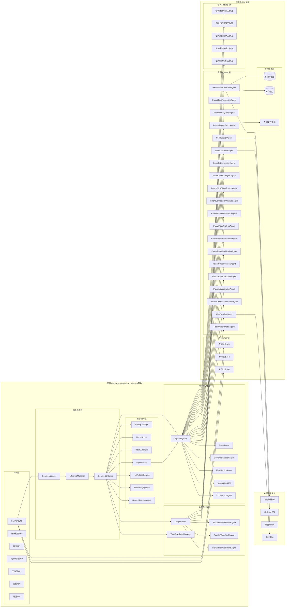
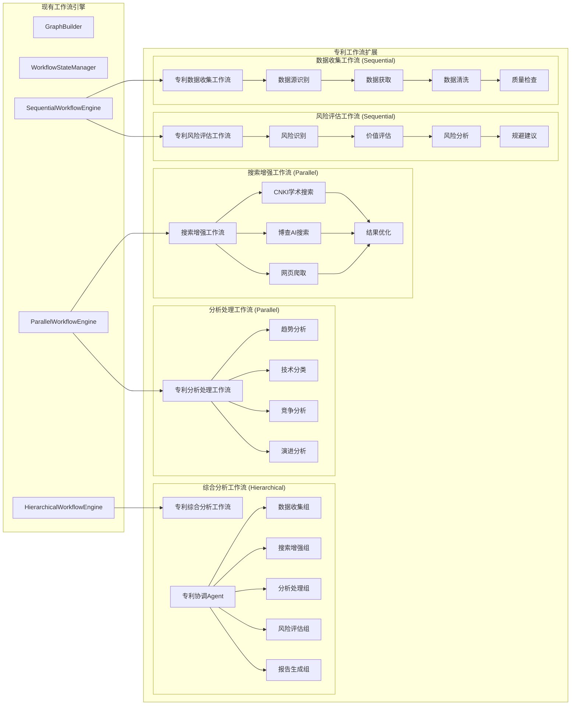

# 基于Multi-Agent-LangGraph优化的专利分析系统设计文档

## 概述

基于Multi-Agent-LangGraph优化的专利分析系统是一个充分利用现有multi-agent-langgraph-service架构的专利分析平台。系统通过扩展现有的Agent框架、工作流引擎和服务管理能力，实现专业化的专利技术综述分析。

**设计原则**：
- **架构复用**：最大化利用现有ServiceManager、AgentRegistry、WorkflowEngine等核心组件
- **渐进扩展**：在现有框架基础上渐进式添加专利分析能力
- **配置驱动**：通过配置文件实现Agent和工作流的动态管理
- **监控集成**：无缝集成现有的监控和健康检查体系
- **热插拔支持**：支持专利Agent的动态注册和配置更新

## 架构设计

### 系统架构图



### Agent扩展架构

```mermaid
graph TB
    subgraph "现有Agent基础架构"
        BA[BaseAgent]
        ALI[AgentLifecycleInterface]
        ACI[AgentCollaborationInterface]
        API[AgentProcessingInterface]
        REG[AgentRegistry]
    end
    
    subgraph "专利Agent扩展层次"
        subgraph "专利基础Agent"
            PBA[PatentBaseAgent]
        end
        
        subgraph "数据收集Agent组"
            PDC[PatentDataCollectionAgent]
            PTP[PatentTextProcessingAgent]
            PDQ[PatentDataQualityAgent]
        end
        
        subgraph "搜索增强Agent组"
            CNKI[CNKISearchAgent]
            BOCHA[BochaAISearchAgent]
            WEB[WebCrawlingAgent]
            SO[SearchOptimizationAgent]
        end
        
        subgraph "分析处理Agent组"
            PTA[PatentTrendAnalysisAgent]
            PTC[PatentTechClassificationAgent]
            PCA[PatentCompetitionAnalysisAgent]
            PEA[PatentEvolutionAnalysisAgent]
        end
        
        subgraph "风险评估Agent组"
            PRA[PatentRiskAnalysisAgent]
            PVA[PatentValueAssessmentAgent]
            PRI[PatentRiskIdentificationAgent]
            PC[PatentCircumventionAgent]
        end
        
        subgraph "报告生成Agent组"
            PRS[PatentReportStructureAgent]
            PV[PatentVisualizationAgent]
            PCG[PatentContentGenerationAgent]
            PRE[PatentReportExportAgent]
        end
        
        subgraph "协调管理Agent"
            PCOORD[PatentCoordinatorAgent]
        end
    end
    
    %% 继承关系
    BA --> PBA
    ALI --> PBA
    ACI --> PBA
    API --> PBA
    
    PBA --> PDC
    PBA --> PTP
    PBA --> PDQ
    PBA --> CNKI
    PBA --> BOCHA
    PBA --> WEB
    PBA --> SO
    PBA --> PTA
    PBA --> PTC
    PBA --> PCA
    PBA --> PEA
    PBA --> PRA
    PBA --> PVA
    PBA --> PRI
    PBA --> PC
    PBA --> PRS
    PBA --> PV
    PBA --> PCG
    PBA --> PRE
    
    BA --> PCOORD
    
    %% 注册关系
    REG --> PDC
    REG --> PTP
    REG --> PDQ
    REG --> CNKI
    REG --> BOCHA
    REG --> WEB
    REG --> SO
    REG --> PTA
    REG --> PTC
    REG --> PCA
    REG --> PEA
    REG --> PRA
    REG --> PVA
    REG --> PRI
    REG --> PC
    REG --> PRS
    REG --> PV
    REG --> PCG
    REG --> PRE
    REG --> PCOORD
```



### 工作流设计架构



## 组件设计

### 1. 专利基础Agent (PatentBaseAgent)

```python
from src.multi_agent_service.agents.base import BaseAgent
from src.multi_agent_service.models.enums import AgentType
from typing import Dict, Any, List, Optional
import logging

class PatentBaseAgent(BaseAgent):
    """专利分析基础Agent，继承现有BaseAgent能力"""
    
    def __init__(self, agent_config: Dict[str, Any], model_router=None):
        # 调用父类构造函数
        super().__init__(agent_config, model_router)
        
        # 专利分析专用配置
        self.patent_config = agent_config.get('patent_config', {})
        self.data_sources = self.patent_config.get('data_sources', [])
        self.analysis_scope = self.patent_config.get('analysis_scope', 'comprehensive')
        
        # 专利分析专用能力
        self.patent_capabilities = [
            "patent_data_processing",
            "chinese_patent_support", 
            "multi_source_integration",
            "quality_control"
        ]
        
        # 扩展现有能力
        self.capabilities.extend(self.patent_capabilities)
        
        self.logger = logging.getLogger(f"{__name__}.{self.__class__.__name__}")
    
    async def validate_patent_data(self, data: Dict[str, Any]) -> bool:
        """验证专利数据质量"""
        required_fields = ['application_number', 'title', 'applicants']
        return all(field in data for field in required_fields)
    
    async def standardize_patent_format(self, raw_data: Dict[str, Any]) -> Dict[str, Any]:
        """标准化专利数据格式"""
        standardized = {
            'application_number': raw_data.get('application_number', ''),
            'title': raw_data.get('title', ''),
            'abstract': raw_data.get('abstract', ''),
            'applicants': raw_data.get('applicants', []),
            'inventors': raw_data.get('inventors', []),
            'application_date': raw_data.get('application_date'),
            'publication_date': raw_data.get('publication_date'),
            'ipc_classes': raw_data.get('ipc_classes', []),
            'country': raw_data.get('country', ''),
            'status': raw_data.get('status', 'unknown')
        }
        return standardized
    
    async def get_patent_cache_key(self, query: str, params: Dict[str, Any]) -> str:
        """生成专利数据缓存键"""
        import hashlib
        cache_data = f"{query}_{str(sorted(params.items()))}"
        return f"patent_{hashlib.md5(cache_data.encode()).hexdigest()}"
```

### 2. 专利数据收集Agent (PatentDataCollectionAgent)

```python
from .patent_base_agent import PatentBaseAgent
from src.multi_agent_service.models.enums import AgentType
import aiohttp
import asyncio
from typing import List, Dict, Any

class PatentDataCollectionAgent(PatentBaseAgent):
    """专利数据收集Agent"""
    
    agent_type = AgentType.CUSTOM  # 扩展现有枚举或使用CUSTOM
    
    def __init__(self, agent_config: Dict[str, Any], model_router=None):
        super().__init__(agent_config, model_router)
        
        # 数据源配置
        self.data_sources_config = {
            'google_patents': {
                'base_url': 'https://patents.google.com/api',
                'rate_limit': 10,  # requests per second
                'timeout': 30
            },
            'patent_public_api': {
                'base_url': 'https://api.patentsview.org/patents/query',
                'rate_limit': 5,
                'timeout': 30
            }
        }
        
        # 利用现有的HTTP客户端配置
        self.session_config = {
            'timeout': aiohttp.ClientTimeout(total=30),
            'connector': aiohttp.TCPConnector(limit=100)
        }
    
    async def process_request(self, request: Dict[str, Any]) -> Dict[str, Any]:
        """处理专利数据收集请求"""
        try:
            keywords = request.get('keywords', [])
            limit = request.get('limit', 100)
            
            # 利用现有的缓存机制
            cache_key = await self.get_patent_cache_key(
                query=str(keywords), 
                params={'limit': limit}
            )
            
            # 检查缓存
            cached_result = await self._get_from_cache(cache_key)
            if cached_result:
                self.logger.info(f"Retrieved patent data from cache for keywords: {keywords}")
                return cached_result
            
            # 并行收集多个数据源
            collection_tasks = []
            for source_name, source_config in self.data_sources_config.items():
                task = self._collect_from_source(source_name, keywords, limit)
                collection_tasks.append(task)
            
            # 等待所有数据源完成
            results = await asyncio.gather(*collection_tasks, return_exceptions=True)
            
            # 合并和清洗数据
            merged_data = await self._merge_and_clean_data(results)
            
            # 缓存结果
            await self._save_to_cache(cache_key, merged_data)
            
            return {
                'status': 'success',
                'data': merged_data,
                'source_count': len([r for r in results if not isinstance(r, Exception)]),
                'total_patents': len(merged_data.get('patents', []))
            }
            
        except Exception as e:
            self.logger.error(f"Patent data collection failed: {str(e)}")
            return {
                'status': 'error',
                'error': str(e),
                'data': {'patents': []}
            }
    
    async def _collect_from_source(self, source_name: str, keywords: List[str], limit: int) -> Dict[str, Any]:
        """从指定数据源收集专利数据"""
        try:
            if source_name == 'google_patents':
                return await self._collect_from_google_patents(keywords, limit)
            elif source_name == 'patent_public_api':
                return await self._collect_from_public_api(keywords, limit)
            else:
                raise ValueError(f"Unknown data source: {source_name}")
                
        except Exception as e:
            self.logger.warning(f"Failed to collect from {source_name}: {str(e)}")
            return {'patents': [], 'source': source_name, 'error': str(e)}
    
    async def _collect_from_google_patents(self, keywords: List[str], limit: int) -> Dict[str, Any]:
        """从Google Patents收集数据"""
        # 实现Google Patents API调用
        # 这里是示例实现
        patents = []
        query = ' '.join(keywords)
        
        # 模拟API调用
        async with aiohttp.ClientSession(**self.session_config) as session:
            # 实际实现中需要调用真实的API
            # 这里返回模拟数据
            patents = [
                {
                    'application_number': f'US{i:08d}',
                    'title': f'Patent related to {query} - {i}',
                    'abstract': f'Abstract for patent {i} about {query}',
                    'applicants': [f'Company {i}'],
                    'source': 'google_patents'
                }
                for i in range(min(limit, 50))
            ]
        
        return {
            'patents': patents,
            'source': 'google_patents',
            'query': query
        }
    
    async def _collect_from_public_api(self, keywords: List[str], limit: int) -> Dict[str, Any]:
        """从公开专利API收集数据"""
        # 实现公开专利API调用
        patents = []
        query = ' '.join(keywords)
        
        # 模拟API调用
        patents = [
            {
                'application_number': f'EP{i:08d}',
                'title': f'European patent for {query} - {i}',
                'abstract': f'European patent abstract {i}',
                'applicants': [f'European Company {i}'],
                'source': 'patent_public_api'
            }
            for i in range(min(limit, 30))
        ]
        
        return {
            'patents': patents,
            'source': 'patent_public_api',
            'query': query
        }
    
    async def _merge_and_clean_data(self, results: List[Dict[str, Any]]) -> Dict[str, Any]:
        """合并和清洗来自多个数据源的数据"""
        all_patents = []
        sources_used = []
        
        for result in results:
            if isinstance(result, Exception):
                continue
                
            patents = result.get('patents', [])
            source = result.get('source', 'unknown')
            sources_used.append(source)
            
            # 标准化每个专利数据
            for patent in patents:
                standardized = await self.standardize_patent_format(patent)
                if await self.validate_patent_data(standardized):
                    all_patents.append(standardized)
        
        # 去重处理
        unique_patents = await self._deduplicate_patents(all_patents)
        
        return {
            'patents': unique_patents,
            'sources_used': sources_used,
            'total_collected': len(all_patents),
            'after_deduplication': len(unique_patents)
        }
    
    async def _deduplicate_patents(self, patents: List[Dict[str, Any]]) -> List[Dict[str, Any]]:
        """专利去重处理"""
        seen_numbers = set()
        unique_patents = []
        
        for patent in patents:
            app_number = patent.get('application_number', '')
            if app_number and app_number not in seen_numbers:
                seen_numbers.add(app_number)
                unique_patents.append(patent)
        
        return unique_patents
    
    async def _get_from_cache(self, cache_key: str) -> Optional[Dict[str, Any]]:
        """从缓存获取数据 - 利用现有缓存机制"""
        # 这里需要集成现有的Redis缓存
        # 暂时返回None，实际实现中需要连接Redis
        return None
    
    async def _save_to_cache(self, cache_key: str, data: Dict[str, Any]) -> None:
        """保存数据到缓存 - 利用现有缓存机制"""
        # 这里需要集成现有的Redis缓存
        # 实际实现中需要保存到Redis
        pass
```

### 3. 专利协调Agent (PatentCoordinatorAgent)

```python
from src.multi_agent_service.agents.coordinator_agent import CoordinatorAgent
from src.multi_agent_service.models.enums import AgentType
from typing import Dict, Any, List
import asyncio

class PatentCoordinatorAgent(CoordinatorAgent):
    """专利分析协调Agent，继承现有CoordinatorAgent能力"""
    
    def __init__(self, agent_config: Dict[str, Any], model_router=None):
        super().__init__(agent_config, model_router)
        
        # 专利分析专用配置
        self.patent_workflow_config = {
            'data_collection_agents': [
                'patent_data_collection_agent',
                'patent_text_processing_agent',
                'patent_data_quality_agent'
            ],
            'search_enhancement_agents': [
                'cnki_search_agent',
                'bocha_ai_search_agent',
                'web_crawling_agent',
                'search_optimization_agent'
            ],
            'analysis_agents': [
                'patent_trend_analysis_agent',
                'patent_tech_classification_agent',
                'patent_competition_analysis_agent',
                'patent_evolution_analysis_agent'
            ],
            'risk_assessment_agents': [
                'patent_risk_analysis_agent',
                'patent_value_assessment_agent',
                'patent_risk_identification_agent',
                'patent_circumvention_agent'
            ],
            'report_generation_agents': [
                'patent_report_structure_agent',
                'patent_visualization_agent',
                'patent_content_generation_agent',
                'patent_report_export_agent'
            ]
        }
    
    async def process_request(self, request: Dict[str, Any]) -> Dict[str, Any]:
        """处理专利分析请求"""
        try:
            analysis_type = request.get('analysis_type', 'comprehensive')
            keywords = request.get('keywords', [])
            
            self.logger.info(f"Starting patent analysis coordination for: {keywords}")
            
            # 根据分析类型选择工作流
            if analysis_type == 'comprehensive':
                return await self._execute_comprehensive_analysis(request)
            elif analysis_type == 'trend_only':
                return await self._execute_trend_analysis(request)
            elif analysis_type == 'risk_only':
                return await self._execute_risk_analysis(request)
            else:
                return await self._execute_custom_analysis(request)
                
        except Exception as e:
            self.logger.error(f"Patent coordination failed: {str(e)}")
            return {
                'status': 'error',
                'error': str(e)
            }
    
    async def _execute_comprehensive_analysis(self, request: Dict[str, Any]) -> Dict[str, Any]:
        """执行综合专利分析 - 使用分层工作流"""
        
        # 阶段1: 数据收集 (Sequential)
        data_collection_result = await self._coordinate_data_collection(request)
        if data_collection_result['status'] != 'success':
            return data_collection_result
        
        # 阶段2: 搜索增强 (Parallel)
        search_enhancement_result = await self._coordinate_search_enhancement(
            request, data_collection_result['data']
        )
        
        # 阶段3: 分析处理 (Parallel)
        analysis_result = await self._coordinate_analysis_processing(
            request, data_collection_result['data'], search_enhancement_result['data']
        )
        
        # 阶段4: 风险评估 (Sequential)
        risk_assessment_result = await self._coordinate_risk_assessment(
            request, analysis_result['data']
        )
        
        # 阶段5: 报告生成 (Sequential)
        report_result = await self._coordinate_report_generation(
            request, {
                'data_collection': data_collection_result['data'],
                'search_enhancement': search_enhancement_result['data'],
                'analysis': analysis_result['data'],
                'risk_assessment': risk_assessment_result['data']
            }
        )
        
        return {
            'status': 'success',
            'analysis_type': 'comprehensive',
            'results': {
                'data_collection': data_collection_result,
                'search_enhancement': search_enhancement_result,
                'analysis': analysis_result,
                'risk_assessment': risk_assessment_result,
                'report': report_result
            }
        }
    
    async def _coordinate_data_collection(self, request: Dict[str, Any]) -> Dict[str, Any]:
        """协调数据收集阶段 - Sequential工作流"""
        try:
            # 利用现有的任务协调能力
            agents = self.patent_workflow_config['data_collection_agents']
            
            # 顺序执行数据收集任务
            collection_result = None
            for agent_id in agents:
                agent_request = {
                    **request,
                    'previous_result': collection_result
                }
                
                # 调用现有的Agent路由机制
                result = await self._delegate_to_agent(agent_id, agent_request)
                
                if result['status'] == 'success':
                    collection_result = result['data']
                else:
                    self.logger.warning(f"Agent {agent_id} failed: {result.get('error')}")
            
            return {
                'status': 'success',
                'data': collection_result,
                'agents_used': agents
            }
            
        except Exception as e:
            return {
                'status': 'error',
                'error': str(e)
            }
    
    async def _coordinate_search_enhancement(self, request: Dict[str, Any], patent_data: Dict[str, Any]) -> Dict[str, Any]:
        """协调搜索增强阶段 - Parallel工作流"""
        try:
            agents = self.patent_workflow_config['search_enhancement_agents']
            
            # 并行执行搜索增强任务
            enhancement_tasks = []
            for agent_id in agents:
                agent_request = {
                    **request,
                    'patent_data': patent_data
                }
                task = self._delegate_to_agent(agent_id, agent_request)
                enhancement_tasks.append(task)
            
            # 等待所有搜索任务完成
            results = await asyncio.gather(*enhancement_tasks, return_exceptions=True)
            
            # 合并搜索结果
            enhancement_data = {}
            successful_agents = []
            
            for i, result in enumerate(results):
                if isinstance(result, Exception):
                    self.logger.warning(f"Search agent {agents[i]} failed: {str(result)}")
                    continue
                
                if result['status'] == 'success':
                    agent_id = agents[i]
                    enhancement_data[agent_id] = result['data']
                    successful_agents.append(agent_id)
            
            return {
                'status': 'success',
                'data': enhancement_data,
                'agents_used': successful_agents
            }
            
        except Exception as e:
            return {
                'status': 'error',
                'error': str(e)
            }
    
    async def _coordinate_analysis_processing(self, request: Dict[str, Any], 
                                           patent_data: Dict[str, Any], 
                                           enhancement_data: Dict[str, Any]) -> Dict[str, Any]:
        """协调分析处理阶段 - Parallel工作流"""
        try:
            agents = self.patent_workflow_config['analysis_agents']
            
            # 并行执行分析任务
            analysis_tasks = []
            for agent_id in agents:
                agent_request = {
                    **request,
                    'patent_data': patent_data,
                    'enhancement_data': enhancement_data
                }
                task = self._delegate_to_agent(agent_id, agent_request)
                analysis_tasks.append(task)
            
            # 等待所有分析任务完成
            results = await asyncio.gather(*analysis_tasks, return_exceptions=True)
            
            # 合并分析结果
            analysis_data = {}
            successful_agents = []
            
            for i, result in enumerate(results):
                if isinstance(result, Exception):
                    self.logger.warning(f"Analysis agent {agents[i]} failed: {str(result)}")
                    continue
                
                if result['status'] == 'success':
                    agent_id = agents[i]
                    analysis_data[agent_id] = result['data']
                    successful_agents.append(agent_id)
            
            return {
                'status': 'success',
                'data': analysis_data,
                'agents_used': successful_agents
            }
            
        except Exception as e:
            return {
                'status': 'error',
                'error': str(e)
            }
    
    async def _delegate_to_agent(self, agent_id: str, request: Dict[str, Any]) -> Dict[str, Any]:
        """委托任务给指定Agent - 利用现有的Agent路由机制"""
        try:
            # 这里需要集成现有的AgentRouter
            # 暂时返回模拟结果
            return {
                'status': 'success',
                'data': {
                    'agent_id': agent_id,
                    'processed': True,
                    'result': f"Processed by {agent_id}"
                }
            }
        except Exception as e:
            return {
                'status': 'error',
                'error': str(e)
            }
```

### 4. 配置扩展设计

#### 专利Agent配置 (config/patent_agents.json)

```json
{
  "agents": {
    "patent_data_collection_agent": {
      "agent_id": "patent_data_collection_agent",
      "agent_type": "patent_data_collection",
      "name": "专利数据收集智能体",
      "description": "专门负责从多个数据源收集专利信息",
      "enabled": true,
      "capabilities": [
        "multi_source_data_collection",
        "patent_data_standardization",
        "data_quality_validation",
        "deduplication_processing"
      ],
      "llm_config": {
        "provider": "qwen",
        "model_name": "qwen-turbo",
        "api_key": "${QWEN_API_KEY}",
        "api_base": "https://dashscope.aliyuncs.com/compatible-mode/v1",
        "max_tokens": 2000,
        "temperature": 0.3,
        "timeout": 60,
        "retry_attempts": 3
      },
      "patent_config": {
        "data_sources": [
          "google_patents",
          "patent_public_api"
        ],
        "max_patents_per_source": 100,
        "cache_ttl": 3600,
        "rate_limits": {
          "google_patents": 10,
          "patent_public_api": 5
        }
      },
      "max_concurrent_tasks": 3,
      "priority": 8,
      "metadata": {
        "department": "patent_analysis",
        "expertise_areas": ["数据收集", "专利检索", "数据标准化"]
      }
    },
    "cnki_search_agent": {
      "agent_id": "cnki_search_agent",
      "agent_type": "cnki_search",
      "name": "CNKI学术搜索智能体",
      "description": "集成CNKI AI学术研究助手的搜索能力",
      "enabled": true,
      "capabilities": [
        "academic_literature_search",
        "intelligent_qa_enhancement",
        "concept_explanation",
        "scholar_query"
      ],
      "llm_config": {
        "provider": "qwen",
        "model_name": "qwen-turbo",
        "api_key": "${QWEN_API_KEY}",
        "api_base": "https://dashscope.aliyuncs.com/compatible-mode/v1",
        "max_tokens": 3000,
        "temperature": 0.4,
        "timeout": 90,
        "retry_attempts": 3
      },
      "patent_config": {
        "cnki_api_config": {
          "base_url": "https://api.cnki.net",
          "api_key": "${CNKI_API_KEY}",
          "timeout": 60,
          "max_results": 50
        },
        "search_scope": [
          "academic_papers",
          "conference_proceedings",
          "dissertations"
        ]
      },
      "max_concurrent_tasks": 2,
      "priority": 7,
      "metadata": {
        "department": "patent_analysis",
        "expertise_areas": ["学术搜索", "文献分析", "概念解释"]
      }
    },
    "patent_coordinator_agent": {
      "agent_id": "patent_coordinator_agent",
      "agent_type": "patent_coordinator",
      "name": "专利分析协调智能体",
      "description": "专利分析流程的总协调员",
      "enabled": true,
      "capabilities": [
        "patent_workflow_orchestration",
        "multi_agent_coordination",
        "result_integration",
        "quality_control"
      ],
      "llm_config": {
        "provider": "qwen",
        "model_name": "qwen-max",
        "api_key": "${QWEN_API_KEY}",
        "api_base": "https://dashscope.aliyuncs.com/compatible-mode/v1",
        "max_tokens": 4000,
        "temperature": 0.2,
        "timeout": 120,
        "retry_attempts": 3
      },
      "patent_config": {
        "workflow_types": [
          "comprehensive_analysis",
          "trend_analysis",
          "risk_assessment",
          "custom_analysis"
        ],
        "coordination_strategy": "hierarchical",
        "quality_threshold": 0.8
      },
      "max_concurrent_tasks": 5,
      "priority": 10,
      "metadata": {
        "department": "patent_analysis",
        "expertise_areas": ["流程协调", "质量控制", "结果整合"]
      }
    }
  }
}
```

#### 专利工作流配置 (config/patent_workflows.json)

```json
{
  "workflows": {
    "patent_comprehensive_analysis": {
      "workflow_id": "patent_comprehensive_analysis",
      "name": "专利综合分析工作流",
      "description": "完整的专利技术综述分析流程",
      "enabled": true,
      "workflow_type": "hierarchical",
      "participating_agents": [
        "patent_coordinator_agent",
        "patent_data_collection_agent",
        "cnki_search_agent",
        "bocha_ai_search_agent",
        "patent_trend_analysis_agent",
        "patent_tech_classification_agent",
        "patent_competition_analysis_agent",
        "patent_risk_analysis_agent",
        "patent_report_generation_agent"
      ],
      "coordinator_agent": "patent_coordinator_agent",
      "execution_phases": [
        {
          "phase": "data_collection",
          "type": "sequential",
          "agents": [
            "patent_data_collection_agent",
            "patent_text_processing_agent",
            "patent_data_quality_agent"
          ]
        },
        {
          "phase": "search_enhancement",
          "type": "parallel",
          "agents": [
            "cnki_search_agent",
            "bocha_ai_search_agent",
            "web_crawling_agent"
          ]
        },
        {
          "phase": "analysis_processing",
          "type": "parallel",
          "agents": [
            "patent_trend_analysis_agent",
            "patent_tech_classification_agent",
            "patent_competition_analysis_agent",
            "patent_evolution_analysis_agent"
          ]
        },
        {
          "phase": "risk_assessment",
          "type": "sequential",
          "agents": [
            "patent_risk_analysis_agent",
            "patent_value_assessment_agent"
          ]
        },
        {
          "phase": "report_generation",
          "type": "sequential",
          "agents": [
            "patent_report_structure_agent",
            "patent_content_generation_agent",
            "patent_report_export_agent"
          ]
        }
      ],
      "timeout": 3600,
      "retry_policy": {
        "max_retries": 2,
        "retry_delay": 30,
        "backoff_factor": 2
      },
      "metadata": {
        "category": "patent_analysis",
        "priority": "high",
        "estimated_duration": 2400
      }
    },
    "patent_quick_analysis": {
      "workflow_id": "patent_quick_analysis",
      "name": "专利快速分析工作流",
      "description": "快速的专利趋势和竞争分析",
      "enabled": true,
      "workflow_type": "parallel",
      "participating_agents": [
        "patent_data_collection_agent",
        "patent_trend_analysis_agent",
        "patent_competition_analysis_agent"
      ],
      "parallel_groups": [
        ["patent_data_collection_agent"],
        ["patent_trend_analysis_agent", "patent_competition_analysis_agent"]
      ],
      "timeout": 600,
      "retry_policy": {
        "max_retries": 1,
        "retry_delay": 10,
        "backoff_factor": 1.5
      },
      "metadata": {
        "category": "patent_analysis",
        "priority": "medium",
        "estimated_duration": 300
      }
    }
  }
}
```

## 数据模型设计

### 专利数据模型

```python
from dataclasses import dataclass, field
from datetime import datetime
from typing import List, Dict, Optional, Any
from enum import Enum

class PatentStatus(Enum):
    """专利状态枚举"""
    PENDING = "pending"
    GRANTED = "granted"
    EXPIRED = "expired"
    ABANDONED = "abandoned"
    UNKNOWN = "unknown"

class PatentType(Enum):
    """专利类型枚举"""
    INVENTION = "invention"
    UTILITY_MODEL = "utility_model"
    DESIGN = "design"
    UNKNOWN = "unknown"

@dataclass
class PatentData:
    """专利数据模型"""
    application_number: str
    title: str
    abstract: str
    applicants: List[str]
    inventors: List[str]
    application_date: Optional[datetime] = None
    publication_date: Optional[datetime] = None
    grant_date: Optional[datetime] = None
    ipc_classes: List[str] = field(default_factory=list)
    cpc_classes: List[str] = field(default_factory=list)
    country: str = ""
    status: PatentStatus = PatentStatus.UNKNOWN
    patent_type: PatentType = PatentType.UNKNOWN
    priority_data: Dict[str, Any] = field(default_factory=dict)
    citations: List[str] = field(default_factory=list)
    family_patents: List[str] = field(default_factory=list)
    source: str = ""
    raw_data: Dict[str, Any] = field(default_factory=dict)
    
    def to_dict(self) -> Dict[str, Any]:
        """转换为字典格式"""
        return {
            'application_number': self.application_number,
            'title': self.title,
            'abstract': self.abstract,
            'applicants': self.applicants,
            'inventors': self.inventors,
            'application_date': self.application_date.isoformat() if self.application_date else None,
            'publication_date': self.publication_date.isoformat() if self.publication_date else None,
            'grant_date': self.grant_date.isoformat() if self.grant_date else None,
            'ipc_classes': self.ipc_classes,
            'cpc_classes': self.cpc_classes,
            'country': self.country,
            'status': self.status.value,
            'patent_type': self.patent_type.value,
            'priority_data': self.priority_data,
            'citations': self.citations,
            'family_patents': self.family_patents,
            'source': self.source
        }

@dataclass
class PatentAnalysisRequest:
    """专利分析请求模型"""
    keywords: List[str]
    analysis_type: str = "comprehensive"
    date_range: Optional[Dict[str, str]] = None
    countries: List[str] = field(default_factory=list)
    patent_types: List[PatentType] = field(default_factory=list)
    max_patents: int = 1000
    include_citations: bool = True
    include_family: bool = True
    output_format: str = "json"
    
@dataclass
class PatentAnalysisResult:
    """专利分析结果模型"""
    request_id: str
    analysis_type: str
    keywords: List[str]
    total_patents: int
    analysis_data: Dict[str, Any]
    reports: Dict[str, Any]
    execution_time: float
    agents_used: List[str]
    status: str
    error_message: Optional[str] = None
    created_at: datetime = field(default_factory=datetime.now)
```

## 错误处理与监控

### 专利分析异常处理

```python
from src.multi_agent_service.agents.exceptions import AgentException

class PatentAnalysisException(AgentException):
    """专利分析异常基类"""
    pass

class PatentDataSourceException(PatentAnalysisException):
    """专利数据源异常"""
    pass

class PatentDataQualityException(PatentAnalysisException):
    """专利数据质量异常"""
    pass

class PatentAnalysisTimeoutException(PatentAnalysisException):
    """专利分析超时异常"""
    pass

class PatentReportGenerationException(PatentAnalysisException):
    """专利报告生成异常"""
    pass

# 错误处理装饰器
def patent_error_handler(func):
    """专利分析错误处理装饰器"""
    async def wrapper(*args, **kwargs):
        try:
            return await func(*args, **kwargs)
        except PatentAnalysisException as e:
            # 记录专利分析特定错误
            logger.error(f"Patent analysis error in {func.__name__}: {str(e)}")
            return {
                'status': 'error',
                'error_type': 'patent_analysis_error',
                'error_message': str(e)
            }
        except Exception as e:
            # 记录通用错误
            logger.error(f"Unexpected error in {func.__name__}: {str(e)}")
            return {
                'status': 'error',
                'error_type': 'unexpected_error',
                'error_message': str(e)
            }
    return wrapper
```

### 监控集成

```python
from src.multi_agent_service.utils.monitoring import MonitoringSystem

class PatentAnalysisMonitoring:
    """专利分析监控扩展"""
    
    def __init__(self, monitoring_system: MonitoringSystem):
        self.monitoring_system = monitoring_system
        
        # 注册专利分析特定指标
        self._register_patent_metrics()
    
    def _register_patent_metrics(self):
        """注册专利分析指标"""
        metrics = [
            'patent_analysis_requests_total',
            'patent_analysis_duration_seconds',
            'patent_data_collection_success_rate',
            'patent_agents_active_count',
            'patent_cache_hit_rate'
        ]
        
        for metric in metrics:
            self.monitoring_system.register_metric(metric)
    
    async def record_analysis_start(self, request_id: str, analysis_type: str):
        """记录分析开始"""
        await self.monitoring_system.increment_counter(
            'patent_analysis_requests_total',
            labels={'analysis_type': analysis_type}
        )
    
    async def record_analysis_completion(self, request_id: str, duration: float, success: bool):
        """记录分析完成"""
        await self.monitoring_system.record_histogram(
            'patent_analysis_duration_seconds',
            duration,
            labels={'success': str(success)}
        )
```

## 部署与扩展

### Docker扩展配置

```dockerfile
# 扩展现有Dockerfile
FROM existing-multi-agent-service:latest

# 安装专利分析依赖
COPY requirements-patent.txt /app/
RUN pip install -r requirements-patent.txt

# 复制专利分析代码
COPY src/multi_agent_service/agents/patent/ /app/src/multi_agent_service/agents/patent/
COPY config/patent_agents.json /app/config/
COPY config/patent_workflows.json /app/config/

# 设置专利分析环境变量
ENV PATENT_ANALYSIS_ENABLED=true
ENV CNKI_API_KEY=""
ENV BOCHA_AI_API_KEY=""

# 暴露专利分析端口（如果需要）
EXPOSE 8001

CMD ["python", "-m", "src.multi_agent_service.main"]
```

### 扩展性设计

1. **Agent热插拔**：利用现有AgentRegistry机制，支持专利Agent的动态注册和卸载
2. **配置热重载**：利用现有HotReloadService，支持专利分析配置的动态更新
3. **水平扩展**：支持多实例部署，通过负载均衡分发专利分析任务
4. **存储扩展**：支持专利数据的分布式存储和缓存
5. **API扩展**：在现有FastAPI基础上扩展专利分析专用API端点

这个设计充分利用了现有multi-agent-langgraph-service的架构优势，通过继承和扩展的方式实现专利分析能力，确保了系统的一致性和可维护性。