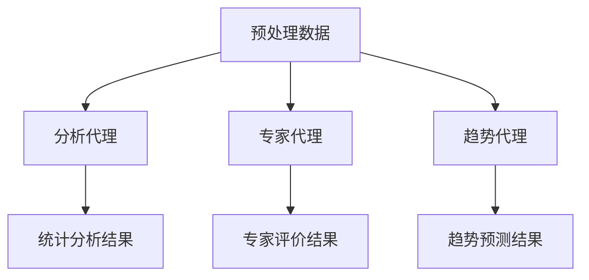
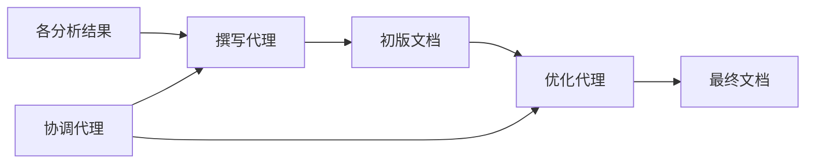
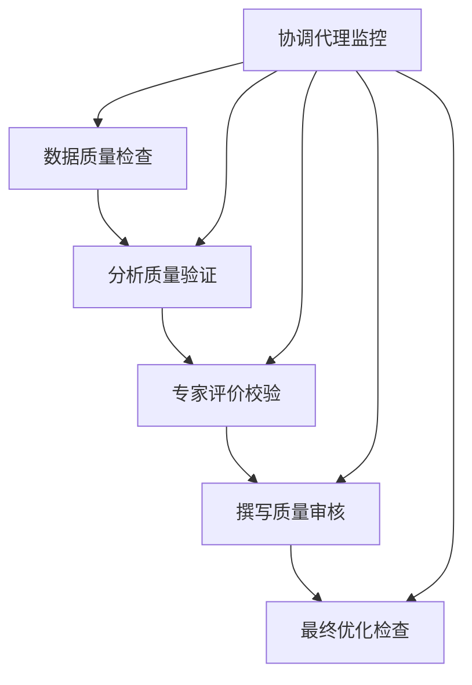

# 专利技术综述AI Agent多代理协作框架

## 代理架构概览

| 代理类型 | 核心职责 | 主要能力 | 输出产物 |
|---------|---------|---------|---------|
| 🔍 检索代理 | 专利数据获取 | 多库检索、数据清洗、质量过滤 | 结构化专利数据集 |
| 📊 分析代理 | 数据统计分析 | 趋势统计、分布分析、关联挖掘 | 统计报告、可视化图表 |
| 🔬 专家代理 | 技术深度解析 | 技术评估、创新判断、价值评价 | 技术评价报告 |
| 📈 趋势代理 | 发展趋势预测 | 时序分析、模式识别、前景预测 | 趋势分析报告 |
| ✍️ 撰写代理 | 文档生成撰写 | 结构化写作、学术表达、逻辑组织 | 综述文档各章节 |
| 🎯 协调代理 | 全局任务调度 | 流程控制、质量监控、进度管理 | 执行计划、质量评估 |
| ⚡ 优化代理 | 内容质量提升 | 文本优化、格式标准化、一致性检查 | 最终优化文档 |

## 代理详细设计

### 🔍 检索代理 (Patent Search Agent)

**核心能力：**
- 多源专利数据库检索（CNABS、DWPI、USPTO、EPO等）
- 智能检索策略生成（关键词组合、分类号匹配、语义检索）
- 数据预处理与质量过滤
- 检索结果去重与标准化

**交互接口：**
```
输入：检索需求规格 {领域、时间范围、地域、申请人类型}
输出：标准化专利数据集 {专利基本信息、技术分类、申请趋势}
```

**内部模块：**
- 检索策略规划器
- 多库接口适配器  
- 数据清洗与标准化器
- 质量评估与过滤器

---

### 📊 分析代理 (Data Analysis Agent)

**核心能力：**
- 专利申请量时序分析
- 地域分布与市场布局分析
- 申请人竞争格局分析
- 技术分类构成统计
- 关联关系挖掘

**交互接口：**
```
输入：标准化专利数据集 + 分析维度配置
输出：多维度统计分析报告 {趋势图表、分布统计、竞争分析}
```

**分析模块：**
- 时间序列分析器
- 地理分布分析器
- 竞争情报分析器
- 技术聚类分析器
- 可视化生成器

---

### 🔬 专家代理 (Technical Expert Agent)

**核心能力：**
- 技术创新水平评估
- 关键专利识别与评价
- 技术发展脉络梳理
- 前沿技术识别
- 技术价值判断

**交互接口：**
```
输入：专利技术内容 + 行业背景知识
输出：技术专家评价报告 {创新度评级、技术成熟度、应用前景}
```

**专业模块：**
- 技术创新度评估器
- 专利质量评价器
- 技术发展脉络分析器
- 前沿技术识别器
- 专业知识库匹配器

---

### 📈 趋势代理 (Trend Analysis Agent)

**核心能力：**
- 技术发展趋势预测
- 市场热点识别
- 技术演进路径分析
- 未来机会点预测
- 风险因素评估

**交互接口：**
```
输入：历史数据 + 专家评价 + 外部环境信息
输出：趋势预测报告 {发展趋势、机会预测、风险警示}
```

**预测模块：**
- 时序预测模型
- 模式识别引擎
- 市场环境分析器
- 机会识别器
- 风险评估器

---

### ✍️ 撰写代理 (Academic Writing Agent)

**核心能力：**
- 学术文档结构化撰写
- 专业术语规范使用
- 逻辑严密的论述组织
- 引用格式标准化
- 多语言学术表达

**交互接口：**
```
输入：各分析模块输出 + 撰写模板 + 质量要求
输出：结构化综述文档 {摘要、正文各章节、结论}
```

**写作模块：**
- 结构规划器
- 内容组织器
- 语言表达优化器
- 引用管理器
- 格式标准化器

---

### 🎯 协调代理 (Coordination Agent)

**核心能力：**
- 全局流程编排与调度
- 任务依赖关系管理
- 质量控制与监督
- 异常处理与恢复
- 进度监控与报告

**交互接口：**
```
输入：用户需求 + 系统配置
输出：执行计划 + 进度报告 + 质量评估
```

**协调模块：**
- 任务调度器
- 依赖关系管理器
- 质量监控器
- 异常处理器
- 进度跟踪器

---

### ⚡ 优化代理 (Content Optimization Agent)

**核心能力：**
- 文档内容一致性检查
- 格式标准化处理
- 语言表达优化
- 逻辑漏洞修复
- 最终质量提升

**交互接口：**
```
输入：初版综述文档 + 优化规则
输出：优化后的最终文档 + 质量报告
```

**优化模块：**
- 一致性检查器
- 格式标准化器
- 语言优化器
- 逻辑检查器
- 质量评价器

## 协作流程设计

### 阶段一：数据获取与预处理


### 阶段二：并行分析处理


### 阶段三：内容生成与优化


## 交互策略设计

| 交互类型 | 触发条件 | 交互协议 | 数据格式 |
|---------|---------|---------|---------|
| **串行依赖** | 上游任务完成 | 同步调用 | 结构化数据传递 |
| **并行协作** | 数据就绪 | 异步并发 | 共享数据池访问 |
| **反馈循环** | 质量问题检测 | 回调机制 | 错误信息+修正建议 |
| **动态调整** | 中间结果评估 | 参数更新 | 配置参数调整 |

## 质量控制机制

### 多层质量检查点


### 质量评价指标体系
| 维度 | 指标 | 阈值 | 检查点 |
|-----|------|------|-------|
| **数据完整性** | 缺失率 | <5% | 检索阶段 |
| **分析准确性** | 统计误差 | <2% | 分析阶段 |
| **专业准确性** | 专家评分 | >8.0 | 评价阶段 |
| **文档质量** | 可读性评分 | >85 | 撰写阶段 |
| **整体一致性** | 逻辑一致性 | >90% | 优化阶段 |

## 扩展性设计

### 代理插件化架构
- **新代理接入**：标准接口规范，支持热插拔
- **能力扩展**：模块化设计，支持功能增强
- **领域适配**：配置化模板，支持不同技术领域
- **语言支持**：多语言模板，支持国际化应用

### 性能优化策略
- **并行处理**：充分利用多核资源，提升处理效率
- **缓存机制**：智能缓存中间结果，避免重复计算
- **负载均衡**：动态任务分配，优化资源利用
- **弹性伸缩**：根据任务量自动调整代理实例数

这个多代理协作框架通过合理的分工协作、标准化的接口设计、完善的质量控制机制，能够高效、准确地完成专利技术综述任务，为用户提供专业、全面的技术分析服务。